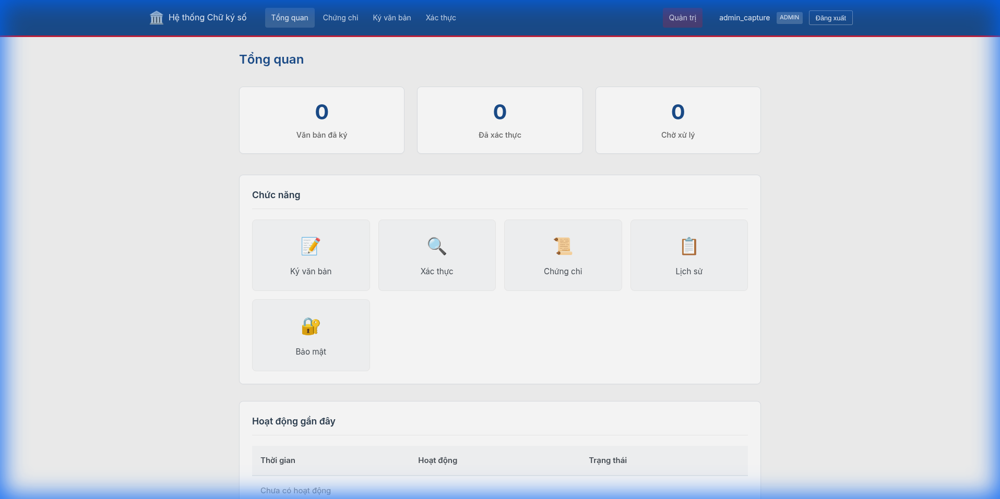
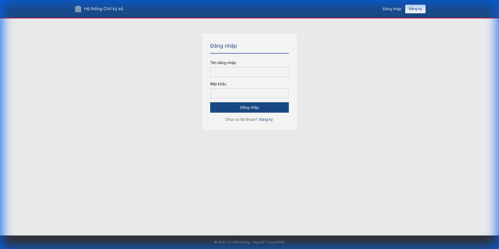
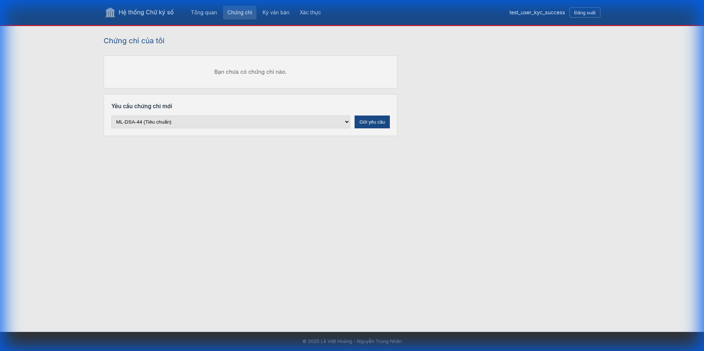
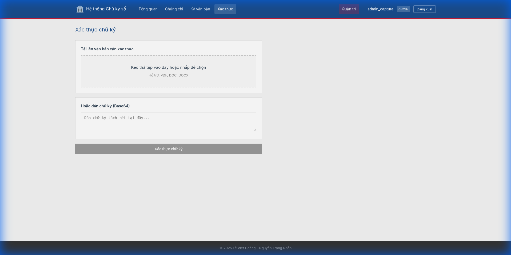
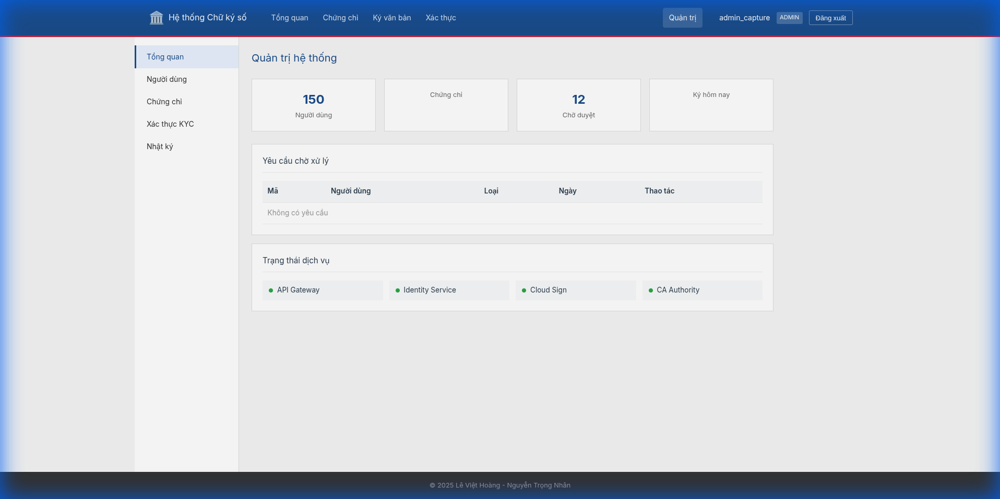

# GovTech PQC Digital Signature System

A compliance-ready digital signature platform for Vietnam's government agencies, implementing **Decree 23/2025/ND-CP** and **Circular 15/2025/TT-BKHCN** requirements.

## 🎯 Compliance Status

| Requirement | Status | Implementation |
|------------|--------|----------------|
| **Sole Control (Article 20)** | ✅ Compliant | Client-Side Keys (Encrypted IndexedDB) |
| **Standard Cryptography** | ✅ Compliant | Pure PQC (ML-DSA / SLH-DSA) |
| **Secure Key Storage** | ✅ Compliant | Browser Encrypted Storage (Non-Exportable) |
| **Subordinate CA Trust** | ✅ Compliant | CSR workflow for National Root CA integration |
| **Long-Term Validation** | ✅ Compliant | RFC 3161 timestamping (TSA integration) |
| **Network Segmentation** | ✅ Compliant | K8s NetworkPolicies with 3 security zones |

## 📸 Features & Screenshots

See **[docs/FEATURES.md](docs/FEATURES.md)** for a complete visual tour of all features.

| Feature | Screenshot |
|---------|------------|
| Dashboard |  |
| Login |  |
| Certificates |  |
| Client-Side Signing |  |
| Signature Verification |  |
| Admin Dashboard |  |

## 🏗️ Architecture

### PKI Hierarchy

See **[docs/PKI_ARCHITECTURE.md](docs/PKI_ARCHITECTURE.md)** for detailed CA design.

```
┌──────────────┐       ┌────────────────────┐       ┌──────────────┐
│   Root CA    │──────▶│  Intermediate CA   │──────▶│  End User    │
│  (Offline)   │       │      (Online)      │       │ (Browser/DB) │
└──────────────┘       └────────────────────┘       └──────────────┘
```

### System Design

```
┌─────────────────────────────────────────────────────────────────────┐
│                         ZONE A: PUBLIC (DMZ)                        │
│   ┌──────────────┐                                                  │
│   │Public Portal │ ◀── Client Browser (PQC Lib)                     │
│   └──────┬───────┘                                                  │
└──────────┼──────────────────────────────────────────────────────────┘
           │
           ▼
┌─────────────────────────────────────────────────────────────────────┐
│                       ZONE B: INTERNAL (Trust)                      │
│   ┌────────────┐  ┌─────────────┐  ┌────────────┐  ┌────────────┐   │
│   │API Gateway │──│Identity Svc │──│Validation  │──│Doc Service │   │
│   └─────┬──────┘  └─────────────┘  └────────────┘  └─────┬──────┘   │
│         │                                                │          │
│   ┌─────┴──────┐  ┌─────────────┐  ┌────────────┐        │          │
│   │ PostgreSQL │  │  TSA Mock   │  │ Org Service│        │          │
│   └────────────┘  └─────────────┘  └────────────┘        │          │
└─────────────────────────────────────────────────────────────────────┘
           │
           ▼
┌─────────────────────────────────────────────────────────────────────┐
│                     ZONE C: SECURE (Air-Gapped)                     │
│   ┌──────────────┐    ┌──────────────┐                              │
│   │ CA Authority │────│   SoftHSM    │                              │
│   │  (Sub-CA)    │    │  (PKCS#11)   │                              │
│   └──────────────┘    └──────────────┘                              │
└─────────────────────────────────────────────────────────────────────┘
```

## 🔐 Security Features

### Client-Controlled Signing
- **Private Keys**: Generated and stored securely in the user's browser (IndexedDB).
- **Sole Control**: Keys are encrypted with a user passphrase and never leave the device.
- **Signing**: Performed locally using WebAssembly PQC libraries.

### Post-Quantum Cryptography (Pure PQC)
The system is built natively for the post-quantum era, using NIST-standardized algorithms:
- **Primary**: **ML-DSA (Dilithium)** - Levels 44, 65, 87.
- **Alternative**: **SLH-DSA-SHAKE-128F** (Stateless Hash-based).

### Offline Root CA
- **Trust Anchor**: The Root CA is completely offline and air-gapped.
- **Tooling**: Dedicated `offline-ca-cli` for key ceremonies and CSR signing.

### Subordinate CA Workflow
```
1. POST /api/v1/ca/init-csr  → Generate CSR for National Root
2. (Manual) Submit CSR to Ban Cơ yếu
3. POST /api/v1/ca/upload-cert → Import signed certificate
```

## 🚀 Quick Start

### Prerequisites
- Docker & Docker Compose
- Kubernetes (Kind recommended for local dev)
- Java 21+ / Gradle 8+

### Deploy to Kind
```bash
cd infra/k8s
./deploy.sh dev apply
```

### Run Tests
```bash
./gradlew test                              # Unit tests
cd tests/e2e && npx playwright test         # Playwright E2E tests
python tests/scripts/test_api.py            # API integration tests
```

## 📁 Project Structure

```
├── apps/
│   └── public-portal/            # Citizen-facing Nuxt.js app (Client PQC)
├── core/
│   ├── ca-authority/             # Certificate Authority (Sub-CA)
│   ├── identity-service/         # Authentication & JWT
│   ├── signature-core/           # Core signing service
│   └── validation-service/       # Signature verification
├── backend/
│   └── offline-ca-cli/           # Offline Root CA Tool
├── libs/
│   └── common-crypto/            # Shared crypto services
│       ├── PqcCryptoService      # ML-DSA / SLH-DSA
│       └── TsaClient             # RFC 3161 timestamping
├── tests/
│   ├── e2e/                      # Playwright E2E tests
│   └── scripts/                  # Python test scripts
├── docs/
│   ├── architecture.md           # System architecture
│   └── reference/mock-ui/        # UI design reference
└── infra/
    ├── certs/                    # Certificates (gitignored)
    ├── k8s/                      # Kubernetes manifests
    └── docker/
        ├── softhsm/              # HSM mock
        └── tsa-mock/             # TSA mock
```


## 📜 Key Components

| Component | Purpose | Port |
|-----------|---------|------|
| `api-gateway` | API routing, TLS termination | 8080 |
| `identity-service` | JWT auth, token blacklist | 8081 |
| `ca-authority` | Certificate issuance, CRL | 8082 |
| `validation-service` | Signature verification | 8085 |
| `offline-ca-cli` | Offline Root CA operations | CLI |
| `softhsm` | PKCS#11 key storage (CA) | 2345 |
| `tsa-mock` | RFC 3161 timestamps | 8318 |

## 📋 Regulatory Compliance

This system is designed to comply with:

- **Decree 23/2025/ND-CP** - Digital signatures in government
- **Circular 15/2025/TT-BKHCN** - Technical standards for e-signatures
- **FIPS 140-2** - Cryptographic module requirements (via PKCS#11)
- **eIDAS** - EU electronic signatures (for interoperability)

## 🔄 Version History

| Version | Date | Changes |
|---------|------|---------|
| 1.1.0 | 2026-01-10 | Pure PQC System (ML-DSA), Client-Side Signing |
| 1.0.0 | 2025-12-28 | Phase 7: Architecture fixes (SAP, ECDSA, HSM, Sub-CA, LTV) |
| 0.9.0 | 2025-12-27 | Phase 6: JWT blacklist, RBAC |
| 0.8.0 | 2025-12-26 | Phase 5: E2E tests, security audit |

---

**Note**: This is a development/testing environment. For production deployment:
1. Replace SoftHSM with certified HSM (nCipher/Thales)
2. Obtain certificates from National Root CA (Ban Cơ yếu Chính phủ)
3. Deploy to certified government cloud infrastructure
