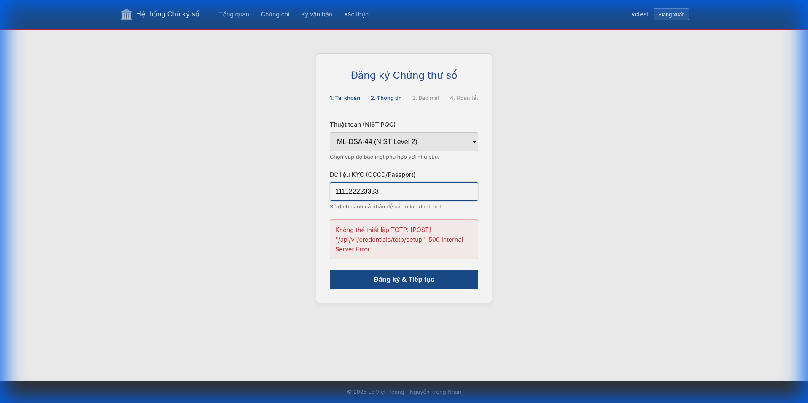
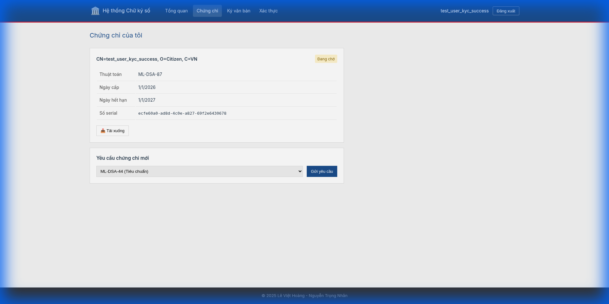
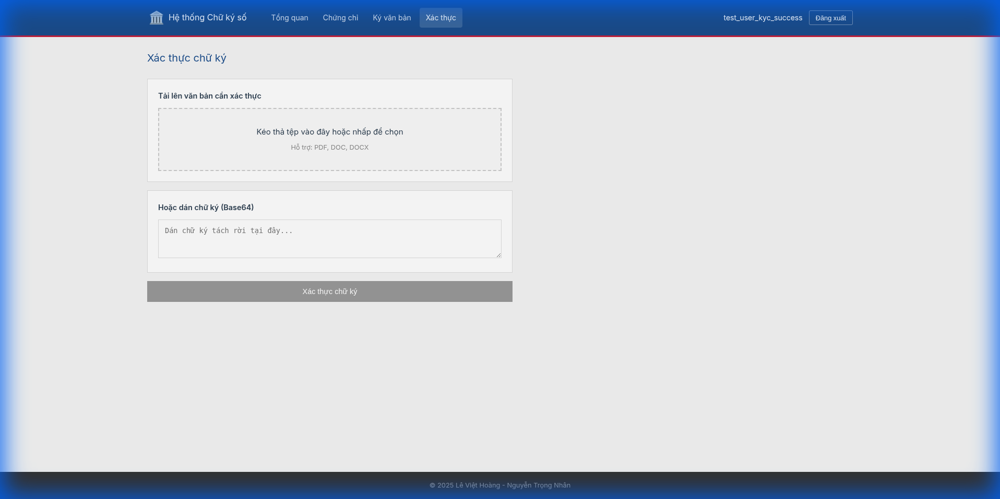
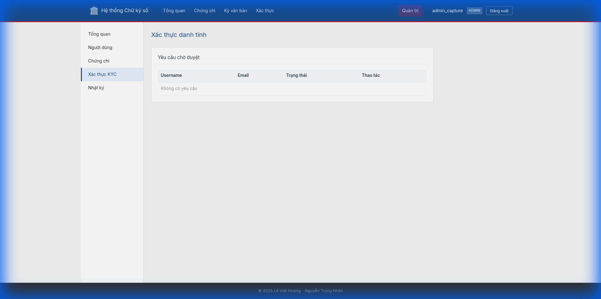
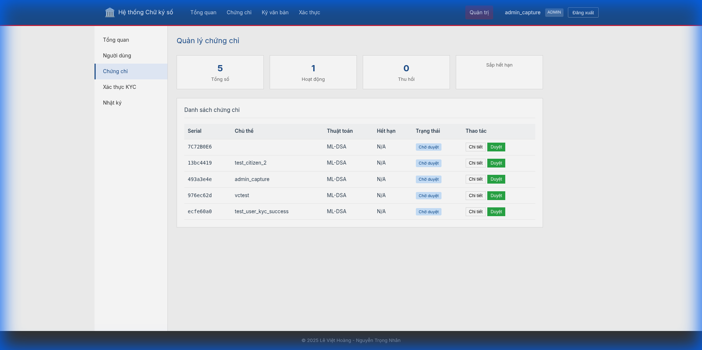

# 🚀 Features & Screenshots

Comprehensive visual documentation of the GovTech PQC Digital Signature Portal.

---

## 🔐 Role-Based Access Control

| Feature | Verified Citizen | Administrator |
|:--------|:----------------:|:-------------:|
| **Generate PQC Keys** | ✅ | ❌ |
| **PQC Document Signing** | ✅ | ❌ |
| **Verify Signatures** | ✅ | ✅ |
| **KYC/User Management** | ❌ | ✅ |

> [!IMPORTANT]
> Only **verified citizens** can generate keys and sign documents. Keys are non-exportable and stored in browser IndexedDB.

---

## 🎬 Working Signing Demo

This flow demonstrates the client-side signing process:
1. Login as verified citizen
2. Upload document
3. Click Sign → **Key Access Modal appears**
4. Enter Passphrase to decrypt private key in memory
5. Sign generated locally (WASM) and attached to PDF

---

## ✍️ Client-Side PQC Signing Process

### Step 1: Document Hash Calculation
The browser calculates the SHA-384 hash of the document locally.

### Step 2: Private Key Retrieval

*Note: Screenshot updated to reflect Key Access UI*

The user provides their passphrase to unlock the encrypted private key from IndexedDB.

### Step 3: Pure PQC Signature
1. **Algorithm**: ML-DSA-65 (Dilithium) or SLH-DSA-SHAKE-128F
2. **Execution**: WebAssembly module performs signature generation in-browser.
3. **Sole Control**: The private key never travels over the network.

---

## 📱 Portal Features

### Dashboard

### Login & Registration

### Certificate Management

### Signature Verification

---

## 🛡️ Admin Portal

### Dashboard & Health

### KYC Management

### Certificate Approval

---

## 📜 Compliance

✅ Decree 23/2025/ND-CP | ✅ Circular 15/2025/TT-BKHCN | ✅ Pure PQC (NIST) | ✅ FIPS 140-2
