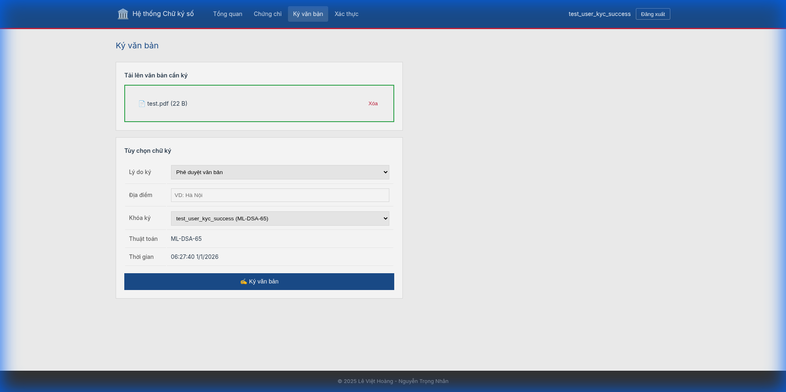

# 🚀 Features & Screenshots

Comprehensive visual documentation of the GovTech PQC Digital Signature Portal.

---

## 🔐 Role-Based Access Control

| Feature | Verified Citizen | Administrator |
|:--------|:----------------:|:-------------:|
| **Request Signing Certificate** | ✅ | ❌ |
| **Sign Documents** | ✅ | ❌ |
| **Verify Signatures** | ✅ | ✅ |
| **KYC/User Management** | ❌ | ✅ |

> [!IMPORTANT]
> Only **verified citizens** can request certificates and sign documents.

---

## 🎬 Working Signing Demo (Video)

This recording shows the complete working flow:
1. Login as verified citizen
2. Upload document
3. Click Sign → **TOTP modal appears**
4. Enter OTP to confirm signature

---

## ✍️ Document Signing Process (SAP Compliance)

### Step 1: Document Ready

### Step 2: TOTP Authentication Modal

**Two-Step Signature Activation Protocol (SAP):**
1. `POST /csc/v1/sign/init` → Returns challengeId
2. Enter TOTP code from authenticator app
3. `POST /csc/v1/sign/confirm` → Signature created

---

## 📱 Portal Features

### Dashboard

### Login & Registration

### Certificate Management

### Signature Verification

---

## 🛡️ Admin Portal

### Dashboard & Health

### KYC Management

### Certificate Approval

---

## 📜 Compliance

✅ Decree 23/2025/ND-CP | ✅ Circular 15/2025/TT-BKHCN | ✅ CSC API v2.0 | ✅ FIPS 140-2
