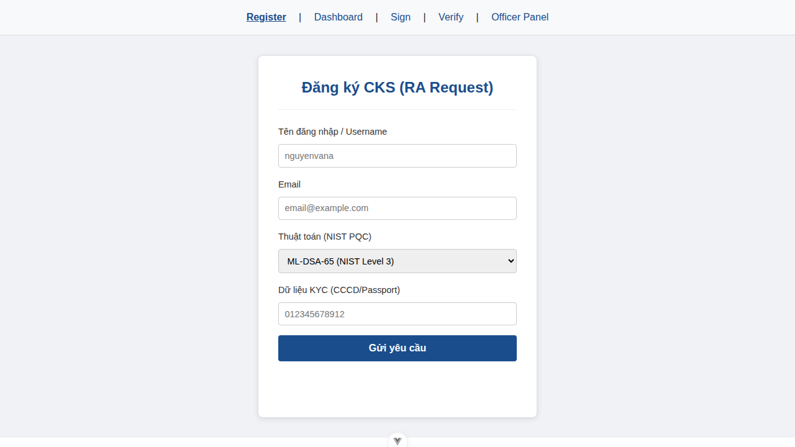
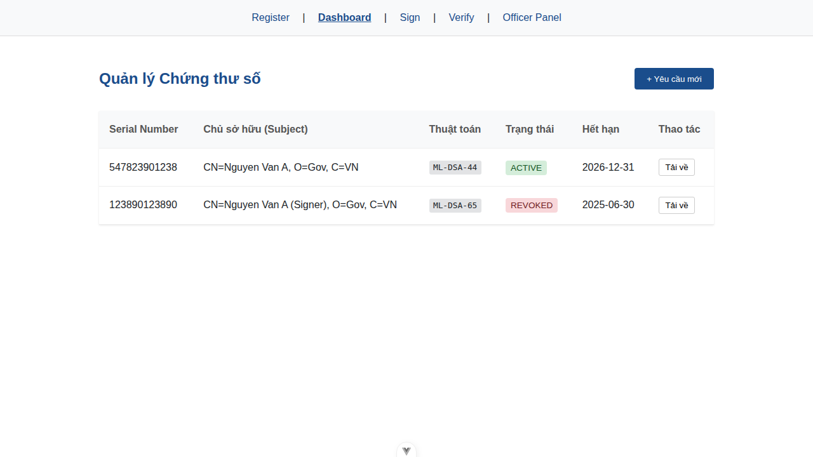
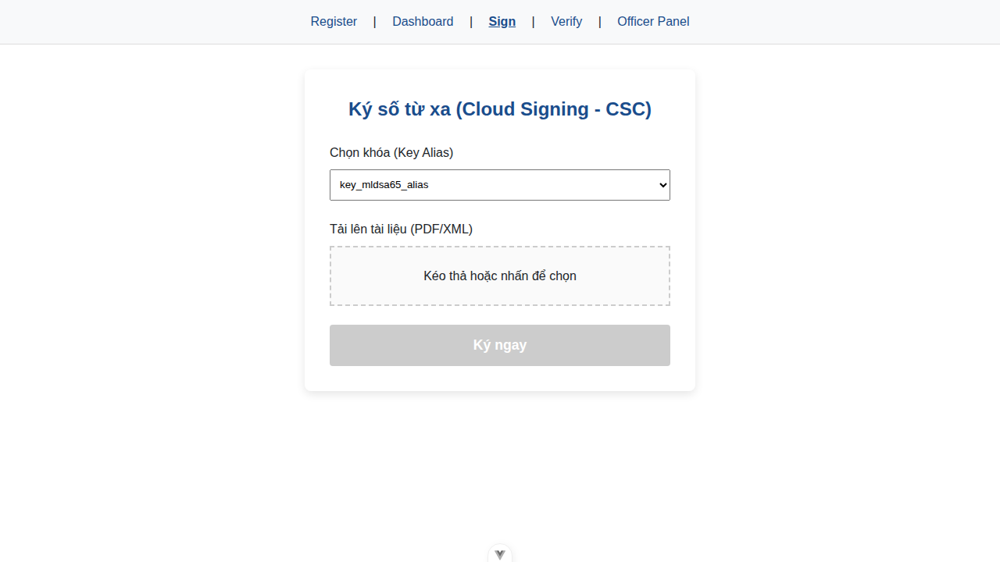
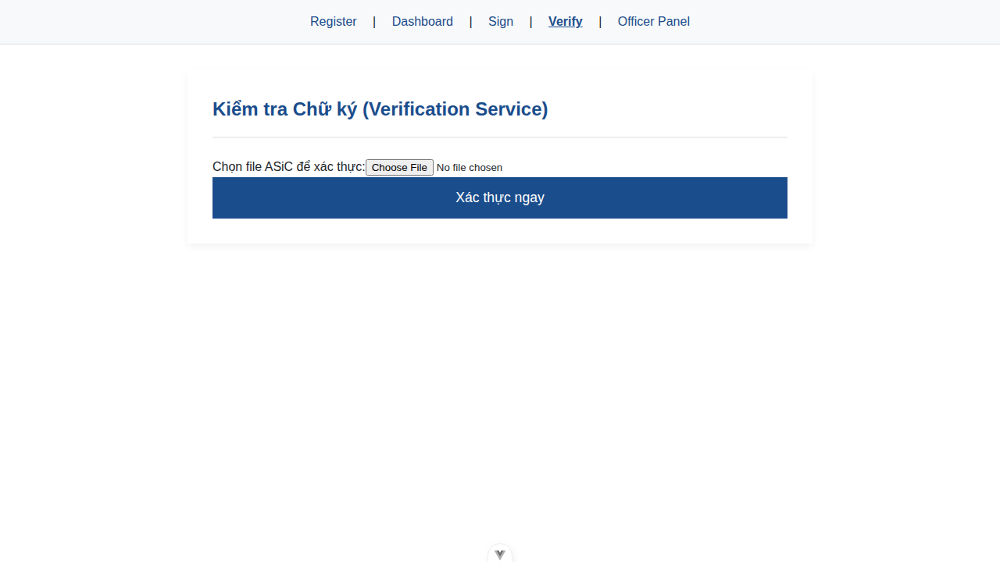
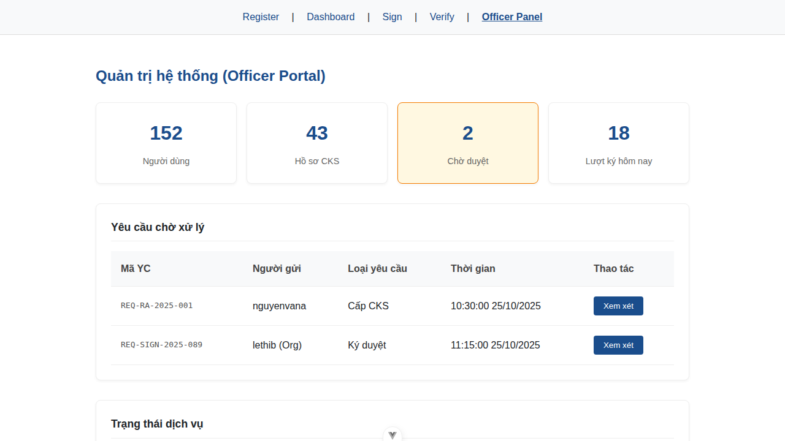
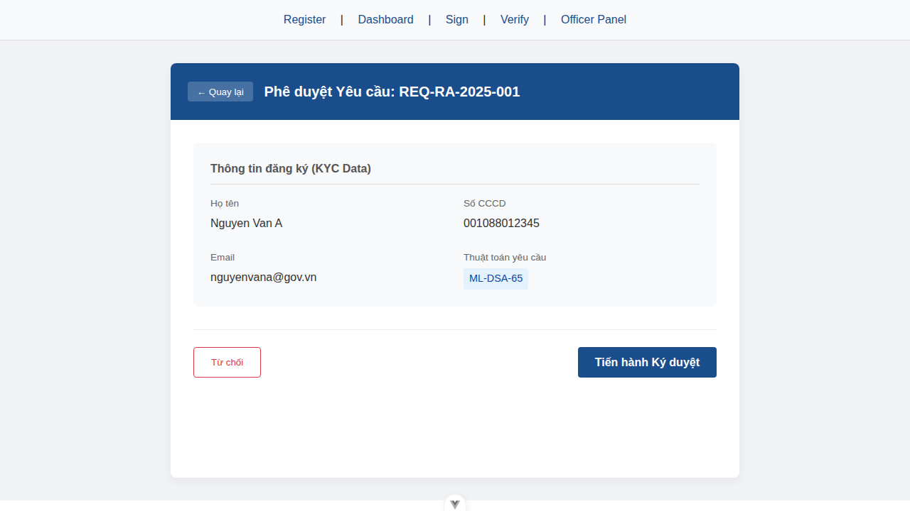
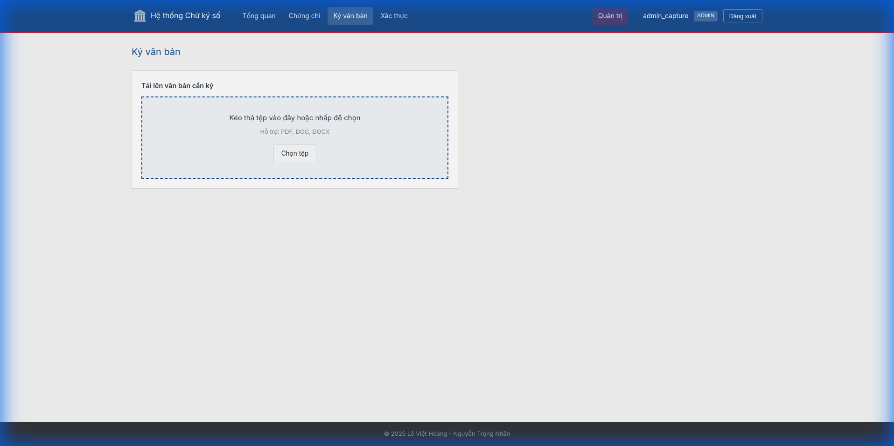
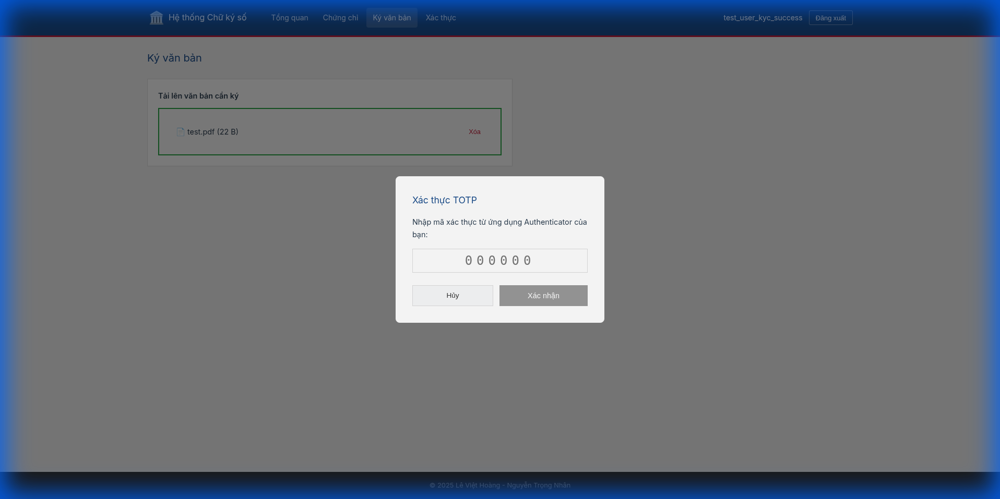
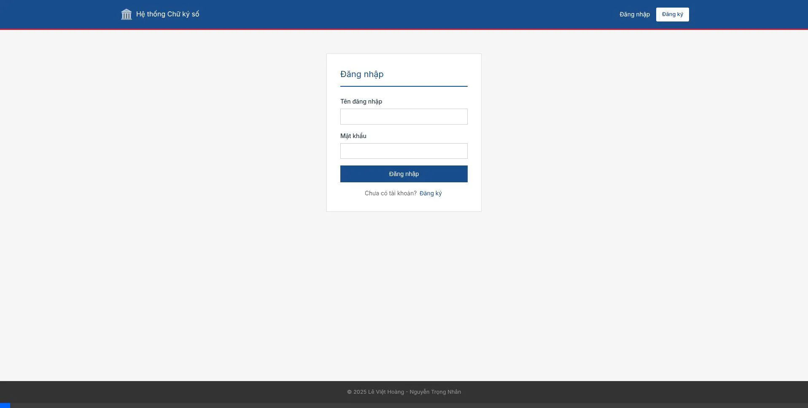

# 🚀 Features & Screenshots

Comprehensive visual documentation of the GovTech PQC Digital Signature Portal.

## 🔐 Role-Based Access Control

| Feature | Citizens | Officers |
|:--------|:--------:|:--------:|
| **Generate PQC Keys** | ✅ | ❌ |
| **Verify Documents** | ✅ | ✅ |
| **KYC Approval** | ❌ | ✅ |
| **TSA Management** | ❌ | ✅ |

> [!IMPORTANT]
> **Sole Control**: Only Citizens hold private keys (in Browser IndexedDB). Admins cannot sign on their behalf.

## 📱 Portal Views

### Registration View
New user registration with PQC key generation and CSR submission.

*Original screenshot: [registration.png](screenshots/registration.png)*

### Dashboard View
Certificate management with status tracking and download functionality.

*Original screenshot: [dashboard.png](screenshots/dashboard.png)*

### Sign View
Remote document signing with Cloud Signature Consortium (CSC) protocol.

*Original screenshots: [sign.png](screenshots/sign.png), [sign_upload.png](screenshots/sign_upload.png)*

### Verify View
ASiC-E signature verification with detailed results.

*Original screenshot: [verify_interface.png](screenshots/verify_interface.png)*

### Officer Dashboard
System administration and monitoring for government officers.

*Original screenshot: [admin_dashboard.png](screenshots/admin_dashboard.png)*

### Officer Review
Detailed review and approval of certificate requests.

*Original screenshot: [admin_kyc.png](screenshots/admin_kyc.png)*

## 🎬 Signing Process (ASiC-E)

### Step 1: Upload & Hash
The user uploads a document. The browser calculates the SHA-384 hash locally.

### Step 2: Key Access (Sole Control)
The user unlocks their Private Key with a passphrase. The key is decrypted in memory.

### Step 3: ASiC Generation
1.  **Sign**: WASM module generates ML-DSA signature.
2.  **Package**: The backend wraps the signature and document into an `.asic` container.
3.  **Download**: The user receives a `package.asic` file.

## 📹 Workflow Videos

### Complete Signing Flow

*Full end-to-end signing workflow demonstration*

### Citizen Signing Flow

*Step-by-step citizen document signing process*

### TOTP Signing Demo

*Two-factor authentication during signing*

## 📜 Compliance Standards

- **Decree 23**: Full compliance for Digital Signatures.
- **Pure PQC**: NIST FIPS 204 (ML-DSA).
- **Format**: ETSI EN 319 162 (ASiC-E).

## 📚 Additional Documentation

For detailed component documentation and technical specifications, see:
- **[Frontend Guide](FRONTEND_GUIDE.md)**: Complete component catalog and workflows
- **[UI Guide](UI_GUIDE.md)**: Component usage and testing guidelines
- **[API Reference](specs/API_V1.md)**: Backend API endpoints
