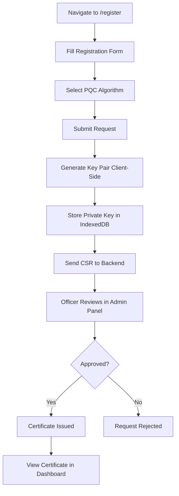
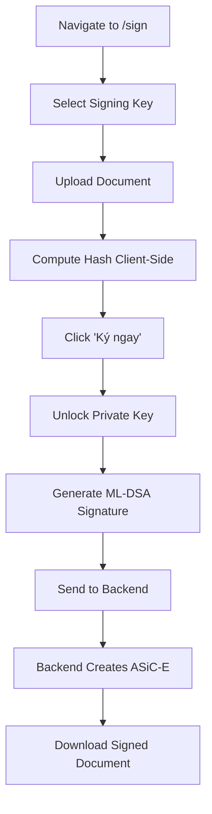
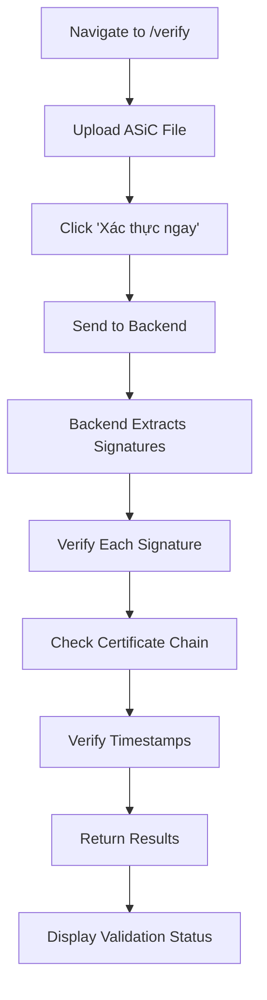
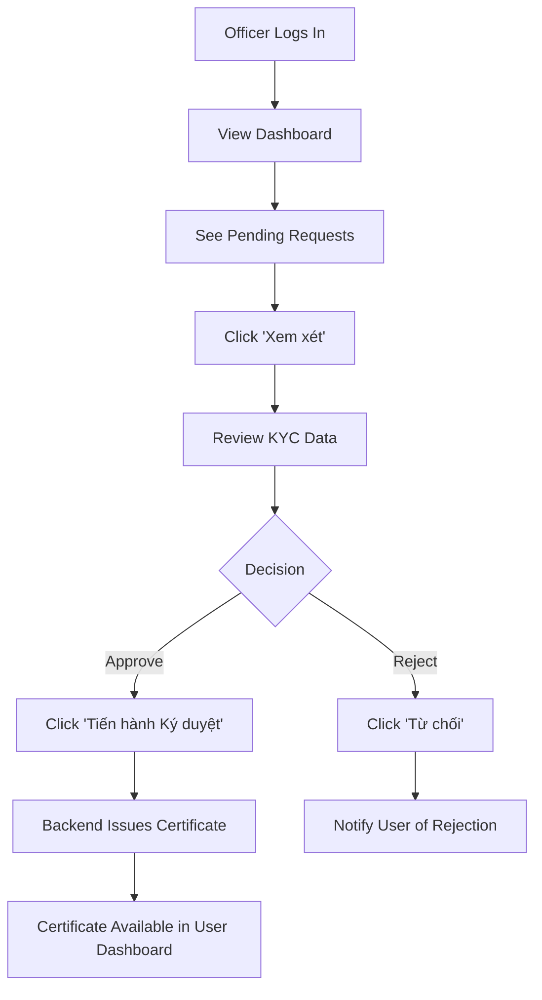

# Frontend Application Guide

This document provides a comprehensive overview of all components and workflows in the GovTech PQC Digital Signature Portal frontend application.

## Table of Contents
- [Architecture Overview](#architecture-overview)
- [Component Catalog](#component-catalog)
- [User Workflows](#user-workflows)
- [Screenshots](#screenshots)

## Architecture Overview

The frontend is built with:
- **Framework**: Vue 3 with Composition API
- **Build Tool**: Vite
- **Language**: TypeScript
- **Styling**: Scoped CSS
- **Cryptography**: liboqs WASM for Post-Quantum Cryptography
- **State Management**: Pinia (for complex state if needed)
- **Routing**: Vue Router

### Project Structure
```
apps/public-portal/
├── src/
│   ├── views/           # Page components
│   │   ├── RegisterView.vue      # User registration
│   │   ├── DashboardView.vue     # Certificate management
│   │   ├── SignView.vue          # Document signing
│   │   ├── VerifyView.vue        # Signature verification
│   │   └── officer/              # Officer-only views
│   │       ├── OfficerDashboard.vue
│   │       └── OfficerReviewView.vue
│   ├── services/        # API and cryptography services
│   │   ├── api.ts               # Backend API integration
│   │   └── pqc.ts               # PQC key generation & signing
│   ├── router/          # Route definitions
│   └── App.vue          # Root component
└── package.json
```

## Component Catalog

### 1. Registration View (`RegisterView.vue`)

**Purpose**: New user registration with PQC key generation

**Features**:
- User information collection (username, email, KYC data)
- Algorithm selection (ML-DSA-44/65/87, SLH-DSA-SHAKE-128F)
- Client-side PQC key pair generation
- Certificate Signing Request (CSR) generation
- Secure private key storage in browser IndexedDB

**Screenshot**:


**Key Fields**:
- Username (Tên đăng nhập)
- Email
- Algorithm selection (Thuật toán NIST PQC)
- KYC Data (CCCD/Passport number)

**Workflow**:
1. User fills in registration form
2. Selects preferred PQC algorithm
3. Click "Gửi yêu cầu" (Submit Request)
4. System generates key pair client-side
5. CSR is sent to backend for certificate issuance
6. Private key is encrypted and stored locally

---

### 2. Dashboard View (`DashboardView.vue`)

**Purpose**: Certificate management and overview

**Features**:
- Display all user certificates
- Certificate status tracking (ACTIVE, REVOKED)
- Certificate download functionality
- Request new certificate button
- Certificate details (serial number, subject, algorithm, expiry)

**Screenshot**:


**Certificate Information Displayed**:
- Serial Number
- Subject DN (Distinguished Name)
- Algorithm (ML-DSA-44, ML-DSA-65, etc.)
- Status (ACTIVE/REVOKED)
- Expiry Date
- Download action

**Example Data**:
```
Serial: 547823901238
Subject: CN=Nguyen Van A, O=Gov, C=VN
Algorithm: ML-DSA-44
Status: ACTIVE
Expires: 2026-12-31
```

---

### 3. Sign View (`SignView.vue`)

**Purpose**: Remote document signing with Cloud Signature Consortium (CSC) protocol

**Features**:
- Key alias selection
- Document upload (PDF/XML)
- Client-side document hashing
- Remote signing via CSC protocol
- ML-DSA signature generation
- Signature display in Base64 format

**Screenshot**:


**Workflow**:
1. Select signing key from dropdown
2. Upload document to sign
3. System computes document hash client-side
4. Click "Ký ngay" (Sign Now)
5. WASM module generates PQC signature
6. Signature is displayed in Base64 format
7. Backend packages into ASiC-E container

**Key Selection**:
- `key_mldsa65_alias` (ML-DSA-65)
- `key_mldsa44_alias` (ML-DSA-44)

**Mock Signature Output**:
```
-----BEGIN ML-DSA-65 SIGNATURE-----
MIIFvzCCA6egAwIBAgIUM/WpHYxjDkX/xYrw0+hC7LUjfdswDQYJ...
-----END ML-DSA-65 SIGNATURE-----
```

---

### 4. Verify View (`VerifyView.vue`)

**Purpose**: ASiC-E signature verification

**Features**:
- ASiC file upload (.asic, .zip)
- Signature validation
- Certificate chain verification
- Timestamp verification
- Detailed verification results display
- Multiple signature support

**Screenshot**:


**Verification Details Shown**:
- Overall validity status (Valid/Invalid)
- Document name and size
- Number of signatures
- Per-signature details:
  - Signer name
  - Algorithm used
  - Timestamp
  - Certificate subject/issuer
  - Validity period

**API Integration**:
```typescript
// POST /api/v1/documents/verify-asic
const result = await api.verifyAsic(asicFile)

// Response structure:
{
  valid: boolean,
  signatureCount: number,
  documentName: string,
  documentSize: number,
  signatures: [
    {
      valid: boolean,
      signerName: string,
      algorithm: "ML-DSA (PQC)",
      timestamp: "2025-01-10T12:00:00Z",
      certificateSubject: "CN=User, O=Gov, C=VN",
      // ... more details
    }
  ]
}
```

**Success Display**:
```
✓ Tài liệu Hợp lệ (Valid)
Được xác thực lúc: 10/01/2025, 12:47:23

Document: contract.pdf (245678 bytes)
Status: Verified (2 signatures)

Danh sách Chữ ký:
#1 - 2025-01-10T10:30:00Z - ✓ Valid
   Signer: Nguyen Van A
   Algorithm: ML-DSA (PQC)
```

---

### 5. Officer Dashboard (`OfficerDashboard.vue`)

**Purpose**: System administration and monitoring for government officers

**Features**:
- System statistics dashboard
- Pending request queue
- Service health monitoring
- Request approval workflow

**Screenshot**:


**Statistics Cards**:
- Total Users: 152
- Total Certificates: 43
- Pending Approvals: 2 (highlighted)
- Signatures Today: 18

**Pending Requests Table**:
| Request ID | Sender | Type | Time | Action |
|------------|--------|------|------|--------|
| REQ-RA-2025-001 | nguyenvana | Cấp CKS | 10:30:00 25/10/2025 | Xem xét |
| REQ-SIGN-2025-089 | lethib (Org) | Ký duyệt | 11:15:00 25/10/2025 | Xem xét |

**Service Health**:
- API Gateway: ● Online
- Identity Service: ● Online
- Cloud Sign: ● Online
- CA Authority: ● Online

---

### 6. Officer Review View (`OfficerReviewView.vue`)

**Purpose**: Detailed review and approval of certificate requests

**Features**:
- KYC data verification
- User information display
- Algorithm verification
- Approve/Reject actions
- Signature approval workflow

**Screenshot**:


**Review Information**:
```
Phê duyệt Yêu cầu: REQ-RA-2025-001

Thông tin đăng ký (KYC Data):
├─ Họ tên: Nguyen Van A
├─ Số CCCD: 001088012345
├─ Email: nguyenvana@gov.vn
└─ Thuật toán yêu cầu: ML-DSA-65

Actions:
[Từ chối]  [Tiến hành Ký duyệt]
```

**Workflow**:
1. Officer reviews KYC data
2. Verifies identity documents
3. Checks algorithm selection
4. Either:
   - Approves: Click "Tiến hành Ký duyệt" → Certificate issued
   - Rejects: Click "Từ chối" → Request denied

---

## User Workflows

### Workflow 1: Citizen Registration & Certificate Issuance



**Steps**:
1. User navigates to Register page
2. Fills in username, email, KYC data
3. Selects algorithm (default: ML-DSA-65)
4. Clicks "Gửi yêu cầu"
5. Browser generates PQC key pair using liboqs WASM
6. Private key encrypted and stored in IndexedDB
7. CSR sent to backend PKI service
8. Officer reviews request in Officer Dashboard
9. Upon approval, certificate is issued
10. User can view certificate in Dashboard

### Workflow 2: Document Signing



**Steps**:
1. Navigate to Sign page
2. Select key alias from dropdown
3. Upload PDF or XML document
4. System computes SHA-384 hash
5. Click "Ký ngay" (Sign Now)
6. Browser generates ML-DSA signature using WASM
7. Signature sent to backend
8. Backend packages into ASiC-E container
9. User downloads signed `.asic` file

### Workflow 3: Signature Verification



**Steps**:
1. Navigate to Verify page
2. Upload `.asic` file
3. Click "Xác thực ngay" (Verify Now)
4. Backend extracts document and signatures
5. Verifies each signature against certificate
6. Checks certificate chain up to root CA
7. Validates RFC 3161 timestamps
8. Returns comprehensive results
9. UI displays validation status with details

### Workflow 4: Officer Certificate Approval



**Steps**:
1. Officer accesses `/officer` panel
2. Views pending requests (highlighted count)
3. Clicks "Xem xét" on a request
4. Reviews user KYC data
5. Makes approval decision
6. If approved: Certificate issued and signed by Intermediate CA
7. If rejected: User notified to resubmit
8. User sees active certificate in their Dashboard

---

## Technical Details

### Client-Side Cryptography

The application uses **liboqs** WASM library for PQC operations:

```typescript
// Generate ML-DSA key pair
import pqc from '@/services/pqc'

const keyPair = await pqc.generateKeyPair('ML-DSA-65')
// Returns: { publicKey: Uint8Array, secretKey: Uint8Array }

// Store private key securely
await pqc.storePrivateKey(
  keyPair.secretKey, 
  username, 
  passphrase
)
// Encrypts and stores in IndexedDB

// Generate signature
const signature = await pqc.sign(
  documentHash, 
  keyPair.secretKey
)
```

### API Integration

All API calls go through the centralized API service:

```typescript
import { api } from '@/services/api'

// Upload and sign document
const uploadResult = await api.uploadDocument(file)
const signResult = await api.signDocument(
  uploadResult.data.docId,
  signatureBase64,
  certificateBase64
)

// Verify ASiC
const verifyResult = await api.verifyAsic(asicFile)
if (verifyResult.success && verifyResult.data.valid) {
  // Display success
}
```

### Styling Approach

- **Scoped CSS**: Each component has isolated styles
- **Color Scheme**:
  - Primary Blue: `#1a4d8c` (Government theme)
  - Success Green: `#28a745`
  - Error Red: `#dc3545`
  - Warning Yellow: `#ffc107`
- **Responsive**: Mobile-first design
- **Vietnamese Language**: Primary UI language

---

## Testing the Application

### Development Server

```bash
cd apps/public-portal
npm install
npm run dev
```

Access at: `http://localhost:5173`

### Build Production

```bash
npm run build
# Output: dist/
```

### Linting

```bash
npm run lint      # ESLint
npm run format    # Prettier
```

### Type Checking

```bash
npm run type-check  # Vue TSC
```

---

## Browser Compatibility

**Required Features**:
- IndexedDB for key storage
- WebAssembly for liboqs
- ES2020+ JavaScript
- Fetch API for HTTP requests

**Supported Browsers**:
- Chrome/Edge 90+
- Firefox 88+
- Safari 14+

**Note**: PQC WASM requires modern browsers with WASM SIMD support for optimal performance.

---

## Security Considerations

### Client-Side Key Storage

Private keys are:
1. Generated entirely in the browser
2. Never transmitted to the server
3. Encrypted before storage in IndexedDB
4. Only decrypted in memory when signing

### Sole Control Compliance

Per **Decree 23/2025/ND-CP Article 20**:
- Citizens maintain exclusive control of private keys
- Officers cannot sign on behalf of users
- Keys stored client-side only

### CSP Headers

Production deployment should include:

```
Content-Security-Policy: 
  default-src 'self'; 
  script-src 'self' 'wasm-unsafe-eval';
  connect-src 'self' https://api.example.com;
```

---

## Additional Resources

- **API Documentation**: `/docs/specs/API_V1.md`
- **PKI Architecture**: `/docs/PKI_ARCHITECTURE.md`
- **ASiC Specification**: `/docs/specs/ASIC_PROFILE.md`
- **Existing Screenshots**: `/docs/screenshots/`

---

## Changelog

### 2025-01-10
- Fixed linting issues (unused variables, type errors)
- Fixed CSS typo in SignView (`pading` → `padding`)
- Added `.vue.js` files to `.gitignore`
- Improved TypeScript type safety
- Created comprehensive frontend documentation
- Added screenshots for all major components

---

## Support

For issues or questions:
- Review code in `apps/public-portal/src/`
- Check API integration in `src/services/api.ts`
- Verify PQC operations in `src/services/pqc.ts`
