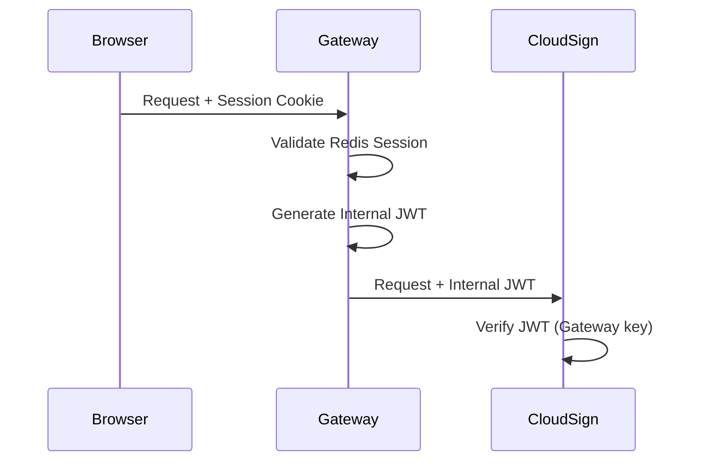
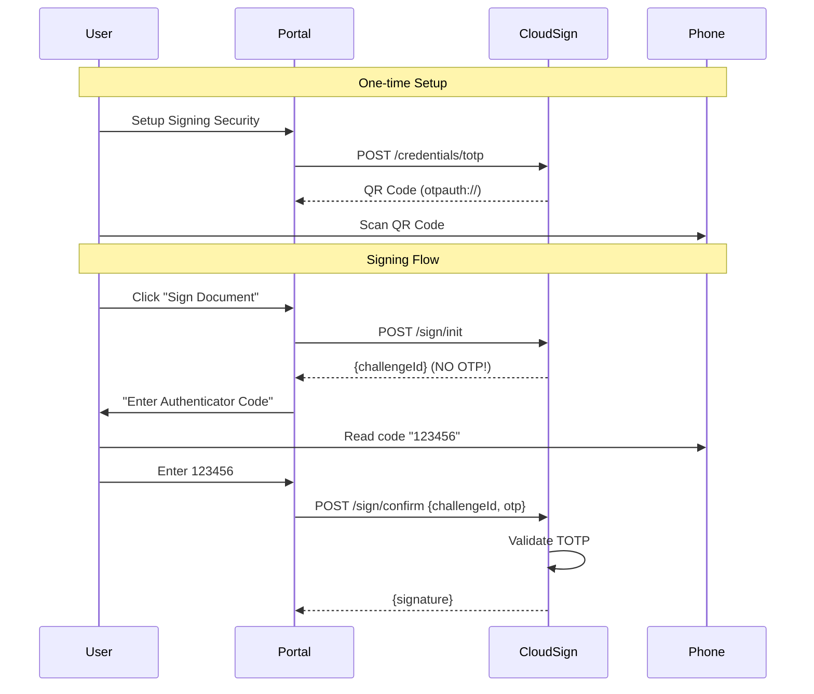

# Security & Design Review - Roadmap

Based on audit review. Status: **PLANNED**

---

## Critical Fixes Required

### 1. Authentication: Gateway Token Exchange

**Problem:** `identity-service` uses Redis Sessions, but `cloud-sign` expects JWTs.

**Solution:**


**Actions:**
- [ ] Add `GatewayJwtFilter` to api-gateway
- [ ] Generate short-lived JWT with username claim
- [ ] Update `cloud-sign` to verify Gateway-signed JWTs
- [ ] Remove `SadValidator.java` string parsing

---

### 2. Sole Control: Implement TOTP

**Problem:** OTP returned in API response allows malware to sign without consent.

**Solution:** Time-Based OTP (Google/Microsoft Authenticator)

**Workflow:**


**Actions:**
- [ ] Add `com.warrenstrange:googleauth` dependency
- [ ] Create `TotpService.java` in cloud-sign
- [ ] Add `POST /credentials/totp` endpoint (returns QR)
- [ ] Modify `/sign/init` - remove OTP from response
- [ ] Add TOTP validation in `/sign/confirm`
- [ ] Store encrypted TOTP secrets in database

**Libraries:**
```gradle
implementation 'com.warrenstrange:googleauth:1.5.0'
```

---

### 3. Key Storage: Database Migration

**Problem:** File-based key storage is stateful and insecure.

**Solution:** Store encrypted key blobs in PostgreSQL.

**Actions:**
- [ ] Update `SoftwareKeyStorageService` to use DB
- [ ] Use `KeyEncryptionService` for encryption
- [ ] Add `user_keys` table with encrypted blob column

---

## Cleanup Tasks

### Delete Legacy Components

- [ ] Remove `signature-core` service (bypasses Sole Control)
- [ ] Delete `@Deprecated` direct `/sign` endpoint
- [ ] Remove `SadValidator.java` manual JWT parsing

---

## Implementation Priority

| Priority | Task | Effort |
|----------|------|--------|
| P0 | Gateway Token Exchange | Medium |
| P0 | TOTP Implementation | Medium |
| P1 | DB Key Storage | Low |
| P2 | Remove signature-core | Low |

---

## Compliance

| Requirement | Current | After Fix |
|-------------|---------|-----------|
| Decree 130 Sole Control | ❌ OTP in response | ✅ TOTP on phone |
| eIDAS Level 2 | ❌ No 2FA | ✅ TOTP 2FA |
| Key Protection | ⚠️ File-based | ✅ DB + Encrypted |
