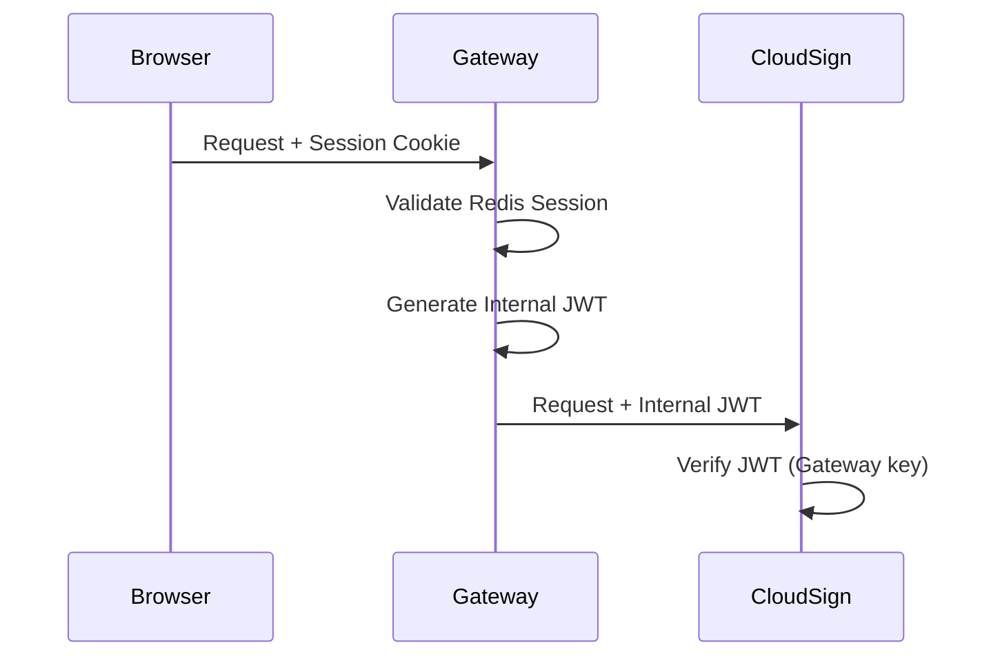
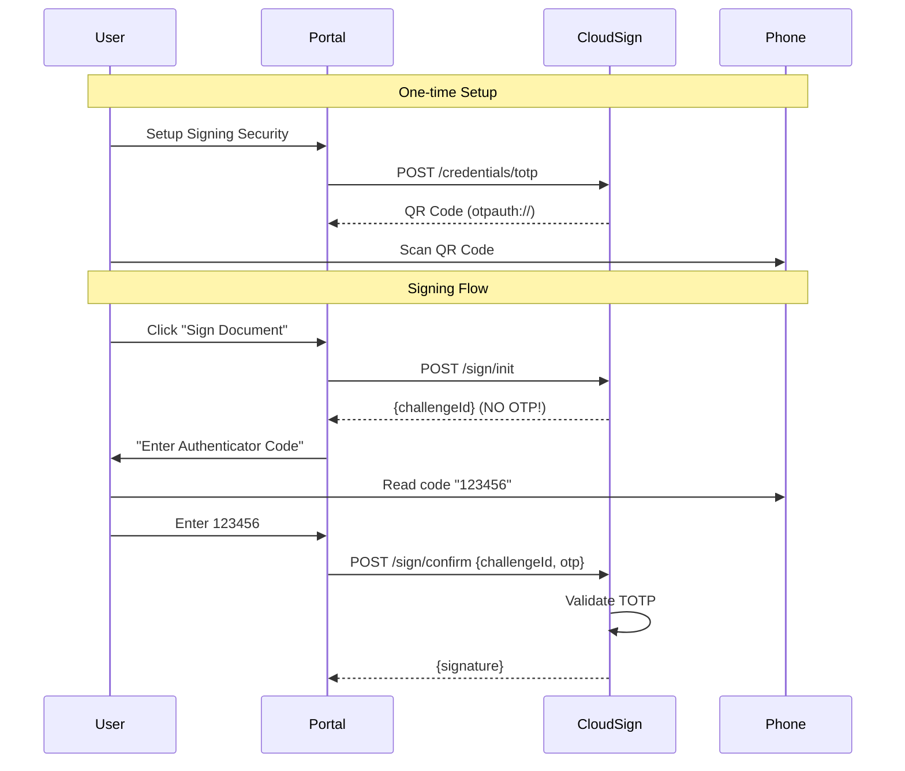

# Security & Design Review - Roadmap

Based on audit review. Status: **PLANNED**

---

## Critical Fixes Required

### 1. Authentication: Gateway Token Exchange

**Problem:** `identity-service` uses Redis Sessions, but `cloud-sign` expects JWTs.

**Solution:**


**Actions:**
- [ ] Add `GatewayJwtFilter` to api-gateway
- [ ] Generate short-lived JWT with username claim
- [ ] Update `cloud-sign` to verify Gateway-signed JWTs
- [ ] Remove `SadValidator.java` string parsing

---

### 2. Sole Control: Implement TOTP

**Problem:** OTP returned in API response allows malware to sign without consent.

**Solution:** Time-Based OTP (Google/Microsoft Authenticator)

**Workflow:**


**Actions:**
- [ ] Add `com.warrenstrange:googleauth` dependency
- [ ] Create `TotpService.java` in cloud-sign
- [ ] Add `POST /credentials/totp` endpoint (returns QR)
- [ ] Modify `/sign/init` - remove OTP from response
- [ ] Add TOTP validation in `/sign/confirm`
- [ ] Store encrypted TOTP secrets in database

**Libraries:**
```gradle
implementation 'com.warrenstrange:googleauth:1.5.0'
```

---

### 3. Key Storage: Database Migration

**Problem:** File-based key storage is stateful and insecure.

**Solution:** Store encrypted key blobs in PostgreSQL.

**Actions:**
- [ ] Update `SoftwareKeyStorageService` to use DB
- [ ] Use `KeyEncryptionService` for encryption
- [ ] Add `user_keys` table with encrypted blob column

---

## Cleanup Tasks

### Delete Legacy Components

- [ ] Remove `signature-core` service (bypasses Sole Control)
- [ ] Delete `@Deprecated` direct `/sign` endpoint
- [ ] Remove `SadValidator.java` manual JWT parsing

---

## Implementation Priority

| Priority | Task | Effort |
|----------|------|--------|
| P0 | Gateway Token Exchange | Medium |
| P0 | TOTP Implementation | Medium |
| P1 | DB Key Storage | Low |
| P2 | Remove signature-core | Low |

---

## PKI Architecture Remediation

### 1. **Offline Root CA (Critical)**

**Problem:** Root CA key is generated and stored online in `ca-authority`, permanently tainting trust.
**Risk:** Compromise of `ca-authority` container = total system key compromise.
**Verified:** `HierarchicalCaService.initializeRootCa` generates/stores key online.

**Solution:**
- [ ] **Delete** `initializeRootCa` logic.
- [ ] Process: Generate Root CA on air-gapped hardware.
- [ ] Action: Import only Root **Certificate** (public key) to application.

### 2. **CSR Proof-of-Possession (Critical)**

**Problem:** System accepts CSRs without verifying signatures.
**Risk:** Rogue Key Attack.
**Verified:** `PqcCryptoService.getPublicKeyFromCsr` skips verification.

**Solution:**
- [ ] Add `ContentVerifierProvider` check in `PqcCryptoService`.

### 3. **OCSP Implementation (Operational)**

**Problem:** Relying solely on CRLs (static, large files).
**Verified:** No OCSP extension or endpoint in `HierarchicalCaService`.

**Solution:**
- [ ] Implement RFC 6960 OCSP Responder.
- [ ] Add `/ocsp` endpoint to query database status.

### 4. **Policy Configuration (Design)**

**Problem:** Hardcoded validity periods and extensions.
**Verified:** `PqcCryptoService` hardcodes `validDays` math.

**Solution:**
- [ ] Create `CertificateProfiles` configuration/table.
- [ ] Define profiles: `CITIZEN_3YR`, `ADMIN_1YR`, `DEVICE_5YR`.

### 5. **RA Selection Logic**

**Problem:** Naive selection (uses first available RA).
**Verified:** `RegistrationServiceImpl` uses `ras.get(0)`.

**Solution:**
- [ ] Implement RA selection based on User attributes (Province/Location).

---

## CA Process & Lifecycle Remediation

### 1. **Identity Integrity (Mocked KYC)**

**Problem:** Registration accepts any request (Mock KYC).
**Verified:** `RegistrationServiceImpl.java` comment: `// 1. Validate KYC (Mock)`.

**Solution:**
- [ ] Integrate with National IDP (eID/eKYC).
- [ ] Implement **Officer Approval Workflow** (`PENDING` -> `APPROVED`).

### 2. **Revocation Publishing (Black Hole CRL)**

**Problem:** CRLs generated but not published to a persistent URL.
**Verified:** `generateCrl` returns string but doesn't write to shared storage.

**Solution:**
- [ ] Configure `crlDistributionPoints` extension in certs (CDP).
- [ ] Create Scheduled Job (Cron) to publish CRLs to Nginx/S3/CDN.

---

## Compliance

| Requirement | Current | After Fix |
|-------------|---------|-----------|
| Decree 130 Sole Control | ❌ OTP in response | ✅ TOTP on phone |
| eIDAS Level 2 | ❌ No 2FA | ✅ TOTP 2FA |
| Key Protection | ⚠️ File-based | ✅ DB + Encrypted |
| **Root CA Security** | ❌ Online/Hot | ✅ Offline/Air-gapped |
| **Identity Verification**| ❌ Mocked | ✅ Officer Approval / eKYC |
| **Revocation** | ❌ Generated-only | ✅ Automated Publishing (CDP) |
