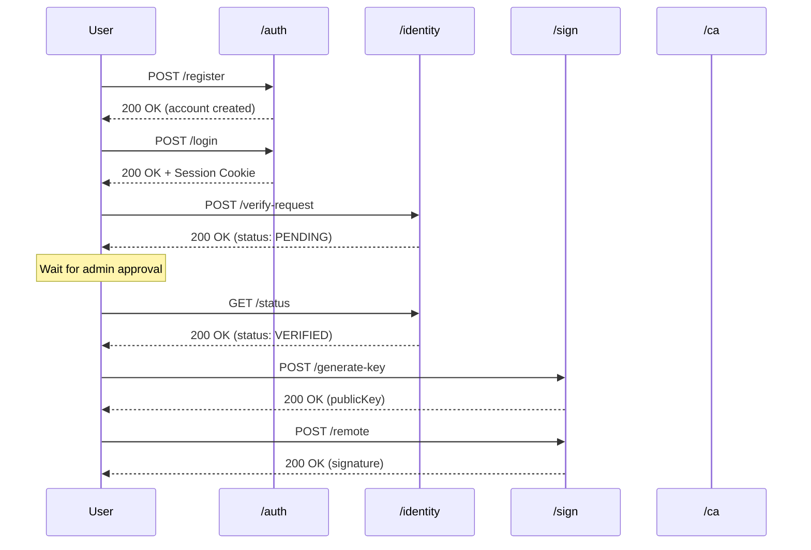
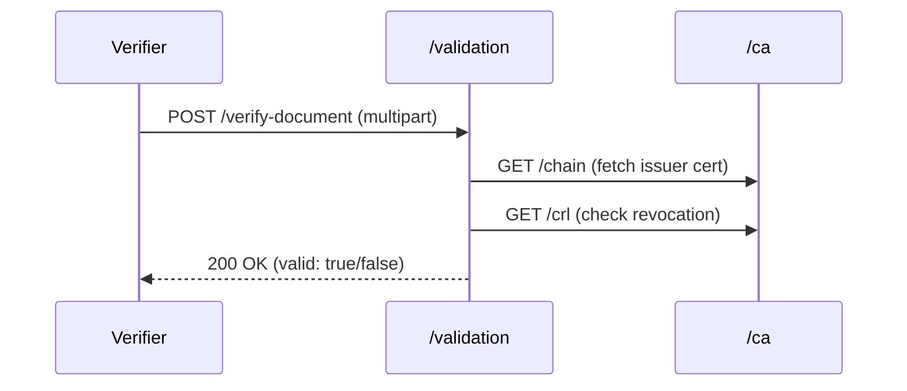
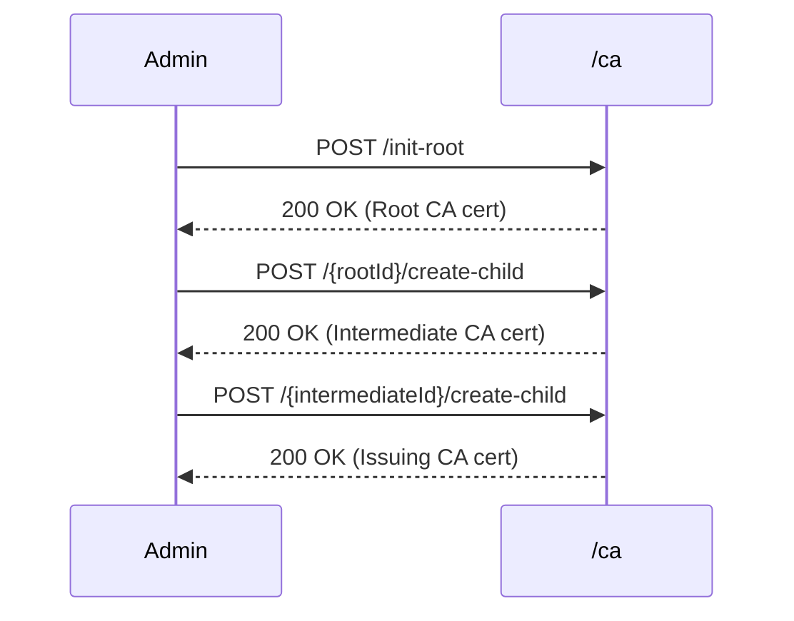

# API Reference

Base URL: `https://api.gov-id.lvh.id.vn/api/v1`

---

## Authentication Model

**Session-based** using Redis. Session ID stored in `JSESSIONID` cookie.

| Header | Value | Required |
|--------|-------|----------|
| Cookie | `JSESSIONID=<session-id>` | All protected endpoints |
| Content-Type | `application/json` | POST/PUT requests |

---

## Workflows

### 1. Citizen Registration & Signing Workflow



### 2. Document Verification Workflow



### 3. CA Hierarchy Setup Workflow



---

## Schema Definitions

### User

| Field | Type | Constraints | Description |
|-------|------|-------------|-------------|
| username | string | 3-50 chars, unique | Login identifier |
| password | string | min 8 chars | Hashed with BCrypt |
| email | string | valid email format | Contact email |
| identityStatus | enum | `UNVERIFIED`, `PENDING`, `VERIFIED` | KYC status |
| role | string | `CITIZEN`, `ADMIN` | Authorization level |

### Certificate Authority

| Field | Type | Constraints | Description |
|-------|------|-------------|-------------|
| id | long | auto-generated | Primary key |
| name | string | 1-100 chars, unique | CA display name |
| level | enum | `ROOT`, `INTERMEDIATE`, `ISSUING` | Hierarchy position |
| algorithm | enum | `ML-DSA-44`, `ML-DSA-65`, `ML-DSA-87` | Signing algorithm |
| status | enum | `PENDING`, `ACTIVE`, `REVOKED`, `EXPIRED` | Lifecycle state |
| parentId | long | null for ROOT | Parent CA reference |
| certificate | text | PEM format | X.509 certificate |
| serialNumber | string | unique, hex | Certificate serial |

### Signing Key

| Field | Type | Constraints | Description |
|-------|------|-------------|-------------|
| alias | string | 1-50 chars, unique per user | Key identifier |
| algorithm | enum | `ML-DSA-44`, `ML-DSA-65`, `ML-DSA-87` | Algorithm |
| publicKey | text | PEM or Base64 | Public key material |
| userId | string | required | Owner reference |
| createdAt | timestamp | auto | Creation time |

### Signature Request

| Field | Type | Constraints | Description |
|-------|------|-------------|-------------|
| userId | string | optional (use session if null) | Signer identity |
| keyAlias | string | default: `default` | Key to use |
| dataBase64 | string | valid Base64, max 10MB | Document hash or data |

### Verification Result

| Field | Type | Description |
|-------|------|-------------|
| valid | boolean | Signature validity |
| signer | string | Certificate subject DN |
| algorithm | string | Signature algorithm used |
| timestamp | ISO8601 | TSA timestamp if present |
| certificateChain | array | Issuer chain to root |
| revocationStatus | enum | `GOOD`, `REVOKED`, `UNKNOWN` |

---

## Business Rules

### Authentication Rules

| Rule | Description |
|------|-------------|
| AUTH-01 | Session expires after 30 minutes of inactivity |
| AUTH-02 | Failed login locks account after 5 attempts (15 min) |
| AUTH-03 | Password must contain uppercase, lowercase, digit |

### Identity Verification Rules

| Rule | Description |
|------|-------------|
| ID-01 | User must be VERIFIED to generate signing keys |
| ID-02 | Only ADMIN can approve verification requests |
| ID-03 | Re-verification required if identity expires |

### Signing Rules

| Rule | Description |
|------|-------------|
| SIGN-01 | Key alias must be unique per user |
| SIGN-02 | Algorithm must match key algorithm |
| SIGN-03 | Timestamp added if TSA available |
| SIGN-04 | User must have valid certificate to sign |

### CA Rules

| Rule | Description |
|------|-------------|
| CA-01 | Only one ROOT CA can be ACTIVE |
| CA-02 | INTERMEDIATE CA requires ACTIVE parent |
| CA-03 | Root uses ML-DSA-87, Intermediate uses ML-DSA-65 |
| CA-04 | CRL regenerated on each revocation |
| CA-05 | Certificate includes CDP and AIA extensions |

### Validation Rules

| Rule | Description |
|------|-------------|
| VAL-01 | Check signature algorithm matches certificate |
| VAL-02 | Verify certificate chain to trusted root |
| VAL-03 | Check CRL for revocation status |
| VAL-04 | Validate timestamp if present |

---

## Endpoint Specifications

### POST /auth/login

**Purpose:** Authenticate user and create session

| Parameter | Location | Type | Required | Constraints |
|-----------|----------|------|----------|-------------|
| username | body | string | yes | 3-50 chars |
| password | body | string | yes | min 8 chars |

**Returns:** Session cookie + user info

**Errors:**
- `401`: Invalid credentials
- `423`: Account locked

---

### POST /sign/generate-key

**Purpose:** Generate ML-DSA key pair for user

| Parameter | Location | Type | Required | Constraints |
|-----------|----------|------|----------|-------------|
| userId | body | string | no | Defaults to session user |
| keyAlias | body | string | yes | 1-50 chars, unique |
| algorithm | body | enum | yes | `ML-DSA-44`, `ML-DSA-65`, `ML-DSA-87` |

**Preconditions:**
- User identity status = `VERIFIED`
- Alias not already in use

**Returns:** alias, algorithm, publicKeyBase64

---

### POST /sign/remote

**Purpose:** Sign data with stored private key

| Parameter | Location | Type | Required | Constraints |
|-----------|----------|------|----------|-------------|
| userId | body | string | no | Defaults to session user |
| keyAlias | body | string | no | Default: `default` |
| dataBase64 | body | string | yes | Valid Base64, max 10MB |

**Returns:** signatureBase64, algorithm

---

### POST /validation/verify-document

**Purpose:** Verify document signature

| Parameter | Location | Type | Required | Constraints |
|-----------|----------|------|----------|-------------|
| document | form-data | file | yes | Max 50MB |
| signature | form-data | string | yes | Base64 encoded |

**Validation Steps:**
1. Decode signature
2. Extract signer certificate
3. Verify signature algorithm
4. Check certificate chain
5. Query CRL for revocation
6. Validate timestamp (if present)

**Returns:** VerificationResult schema

---

### POST /ca/init-root

**Purpose:** Initialize root CA (one-time operation)

| Parameter | Location | Type | Required | Constraints |
|-----------|----------|------|----------|-------------|
| name | body | string | yes | 1-100 chars |
| algorithm | body | enum | no | Default: `ML-DSA-87` |

**Preconditions:**
- No ACTIVE root CA exists
- Caller has ADMIN role

**Business Logic:**
1. Generate ML-DSA-87 key pair
2. Self-sign root certificate
3. Store encrypted private key
4. Set status = ACTIVE

---

## Algorithm Matrix

| Algorithm | OID | Key Size | Sig Size | Use Case |
|-----------|-----|----------|----------|----------|
| ML-DSA-44 | 2.16.840.1.101.3.4.3.17 | 1312 B | 2420 B | User certs |
| ML-DSA-65 | 2.16.840.1.101.3.4.3.18 | 1952 B | 3293 B | Intermediate |
| ML-DSA-87 | 2.16.840.1.101.3.4.3.19 | 2592 B | 4595 B | Root CA |
---

## doc-service Endpoints

### Document Schema

| Field | Type | Description |
|-------|------|-------------|
| id | UUID | Document identifier |
| name | string | Filename |
| ownerId | UUID | Owner's user ID |
| classification | enum | `PUBLIC`, `INTERNAL`, `CONFIDENTIAL` |
| visibility | enum | `PRIVATE`, `PUBLIC` |
| contentHash | string | SHA3-256 hash |
| fileSize | long | Size in bytes |
| contentType | string | MIME type |
| signed | boolean | Has signature |
| encrypted | boolean | Encrypted at rest |
| encryptionAlgorithm | string | `ML-KEM-768+AES-256-GCM` |
| signatureAlgorithm | string | `ML-DSA-44`, `ML-DSA-65` |
| assignedCountersignerId | UUID | Officer assigned to approve |
| countersignatureId | UUID | Link to countersignature |
| approvalStatus | enum | `DRAFT`, `PENDING_COUNTERSIGN`, `APPROVED`, `REJECTED` |
| approvedAt | timestamp | When approved |

### ABAC Rules

| Visibility | Who Can Read | Who Can Write |
|------------|--------------|---------------|
| `PRIVATE` | Owner + Assigned Officer | Owner only |
| `PUBLIC` | All authenticated users | Owner only |

---

### POST /api/v1/doc

**Purpose:** Create new document record

| Parameter | Location | Type | Required |
|-----------|----------|------|----------|
| filename | body | string | yes |
| contentHash | body | string | yes |
| contentType | body | string | yes |
| fileSize | body | long | yes |
| classification | body | enum | yes |
| visibility | body | enum | yes |
| encrypt | body | boolean | no |
| X-User-Id | header | UUID | yes |

**Returns:** DocumentDto with new ID

---

### POST /api/v1/doc/{id}/signature

**Purpose:** Save signature after signing

| Parameter | Location | Type | Required |
|-----------|----------|------|----------|
| id | path | UUID | yes |
| signatureBase64 | body | string | yes |
| timestampBase64 | body | string | no |
| keyAlias | body | string | yes |
| algorithm | body | string | yes |
| certificateSerial | body | string | no |

**Returns:** Updated DocumentDto

---

### GET /api/v1/doc/{id}/download

**Purpose:** Download document content (ABAC enforced)

| Parameter | Location | Type | Required |
|-----------|----------|------|----------|
| id | path | UUID | yes |
| X-User-Id | header | UUID | yes |

**Returns:** Binary content with headers:
- `Content-Type`: document MIME type
- `Content-Disposition`: attachment filename
- `X-Encrypted`: true/false

**ABAC:** PRIVATE documents only accessible by owner or assigned officer.

---

### POST /api/v1/doc/{id}/submit-approval

**Purpose:** Submit document for officer approval (auto-assigns countersigner)

| Parameter | Location | Type | Required |
|-----------|----------|------|----------|
| id | path | UUID | yes |
| X-User-Id | header | UUID | yes |
| X-User-Assigned-Ca | header | UUID | no |

**Returns:** DocumentDto with `assignedCountersignerId` and `approvalStatus: PENDING_COUNTERSIGN`

---

### GET /api/v1/doc/pending-approval

**Purpose:** Get pending documents for officer

| Parameter | Location | Type | Required |
|-----------|----------|------|----------|
| X-User-Id | header | UUID | yes |

**Returns:** List of DocumentDto where `assignedCountersignerId == userId`

---

### POST /api/v1/doc/{id}/countersign

**Purpose:** Officer approves/rejects document

| Parameter | Location | Type | Required |
|-----------|----------|------|----------|
| id | path | UUID | yes |
| X-User-Id | header | UUID | yes |
| countersignatureId | body | UUID | if approved |
| approved | body | boolean | yes |
| rejectionReason | body | string | if rejected |

**ABAC:** Only `assignedCountersignerId` can countersign.

**Returns:** DocumentDto with `approvalStatus: APPROVED` or `REJECTED`

---

### POST /api/v1/doc/{id}/make-public

**Purpose:** Make approved document public

| Parameter | Location | Type | Required |
|-----------|----------|------|----------|
| id | path | UUID | yes |
| X-User-Id | header | UUID | yes |

**ABAC:** Only owner can make public, must be `APPROVED`.

**Returns:** DocumentDto with `visibility: PUBLIC`

---

## identity-service Officer Endpoints

### GET /api/v1/officers/by-ca/{caId}

**Purpose:** Get officers assigned to a CA/RA (used by doc-service)

| Parameter | Location | Type | Required |
|-----------|----------|------|----------|
| caId | path | UUID | yes |

**Returns:** List of OfficerDto
```json
[
  { "id": "uuid", "username": "officer1", "caType": "REGISTRATION_AUTHORITY" }
]
```

---

## HTTP Status Codes

| Code | Meaning | When Used |
|------|---------|-----------|
| 200 | Success | Request completed |
| 201 | Created | Resource created |
| 400 | Bad Request | Invalid input |
| 401 | Unauthorized | No/invalid session |
| 403 | Forbidden | ABAC violation |
| 404 | Not Found | Resource doesn't exist |
| 409 | Conflict | Duplicate resource |
| 423 | Locked | Account locked |
| 500 | Server Error | Internal failure |

