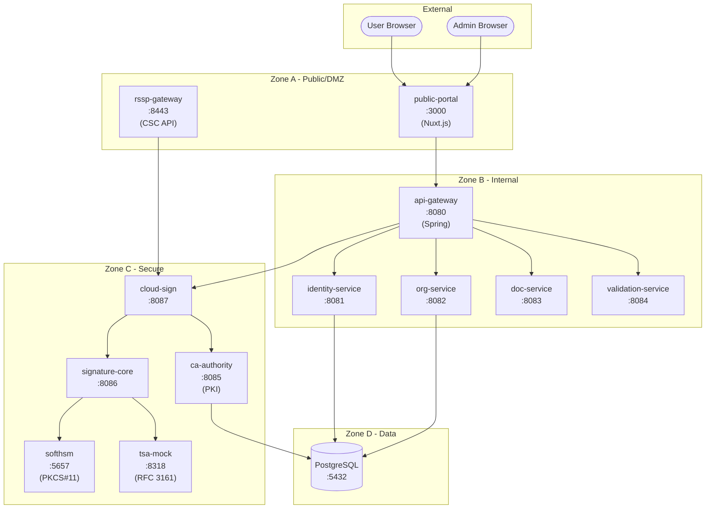
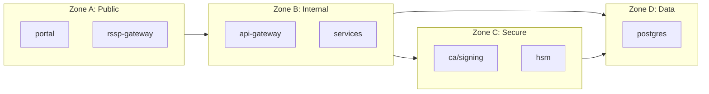

# System Architecture

## Overview

Post-Quantum Cryptography Digital Signature System for Public Administration.

## Architecture Diagram



## Components

### Frontend (Zone A)
| Service | Port | Tech | Purpose |
|---------|------|------|---------|
| public-portal | 3000 | Nuxt.js | Unified citizen/admin UI |
| rssp-gateway | 8443 | Spring | CSC API for remote signing |

### Core Services (Zone B)
| Service | Port | Purpose |
|---------|------|---------|
| api-gateway | 8080 | Request routing, auth |
| identity-service | 8081 | User registration, KYC |
| org-service | 8082 | Organization management |
| doc-service | 8083 | Document storage |
| validation-service | 8084 | Signature verification |

### Secure Services (Zone C)
| Service | Port | Purpose |
|---------|------|---------|
| ca-authority | 8085 | PKI, certificate issuance |
| signature-core | 8086 | Dilithium signing |
| cloud-sign | 8087 | Cloud signing workflow |
| softhsm | 5657 | HSM emulation (PKCS#11) |
| tsa-mock | 8318 | Timestamp authority |

### Data (Zone D)
| Service | Port | Purpose |
|---------|------|---------|
| postgres | 5432 | Persistent storage |

## Security Zones



## Cryptographic Algorithms

| Component | Algorithm | Level |
|-----------|-----------|-------|
| Root CA | ML-DSA-87 | NIST 5 |
| Provincial CA | ML-DSA-65 | NIST 3 |
| User Certificates | ML-DSA-44 | NIST 2 |
| TLS Key Exchange | X25519 + ML-KEM-768 | Hybrid |

## Deployment

```bash
# Apply to Kubernetes
kubectl apply -k infra/k8s/base

# Or with overlay
kubectl apply -k infra/k8s/overlays/dev
```
