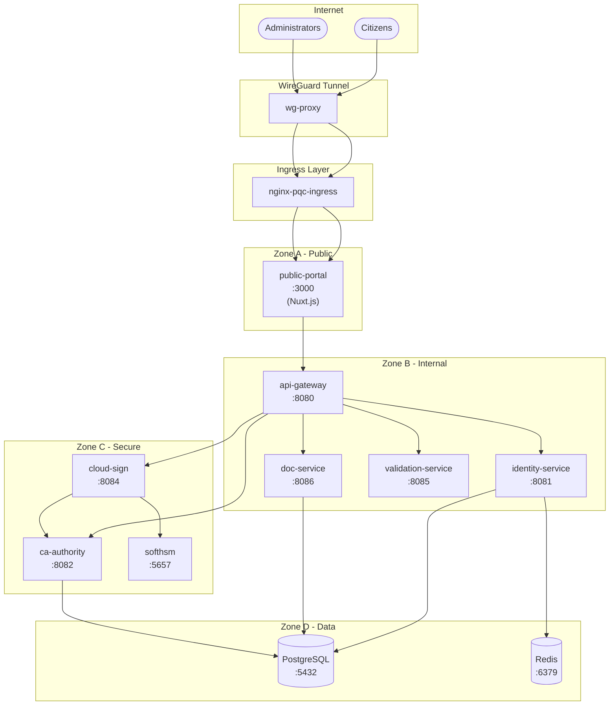
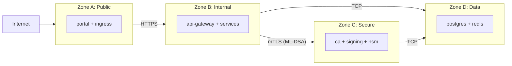

# System Architecture

Post-Quantum Cryptography Digital Signature System for Public Administration.

## High-Level Architecture



---

## Service Components

### Zone A - Public (DMZ)

| Service | Port | Technology | Purpose |
|---------|------|------------|---------|
| public-portal | 3000 | Nuxt.js 3 | Unified citizen/admin portal |
| nginx-pqc-ingress | 80/443 | NGINX | TLS termination, routing |
| wg-proxy | 51820 | WireGuard | Secure tunnel |

### Zone B - Internal Services

| Service | Port | Purpose |
|---------|------|---------|
| api-gateway | 8080 | Request routing, rate limiting |
| identity-service | 8081 | Authentication, registration, KYC |
| doc-service | 8086 | Document storage with encryption |
| validation-service | 8085 | Signature verification |

### Zone C - Secure Services

| Service | Port | Purpose |
|---------|------|---------|
| ca-authority | 8082 | PKI, certificate issuance, CRL |
| cloud-sign | 8084 | Remote signing (CSC API v2.0) |
| softhsm | 5657 | HSM emulation (PKCS#11) |

### Zone D - Data Layer

| Service | Port | Purpose |
|---------|------|---------|
| postgres | 5432 | Persistent storage (users, certs, docs) |
| redis | 6379 | Session storage, caching |

---

## Cryptographic Architecture

### Pure ML-DSA (FIPS 204)

> **100% Post-Quantum** - No ECDSA/RSA for new signing operations.

| Component | Algorithm | Standard | Security Level |
|-----------|-----------|----------|----------------|
| Root CA | ML-DSA-87 | FIPS 204 | NIST Level 5 (256-bit) |
| Sub CA | ML-DSA-87 | FIPS 204 | NIST Level 5 |
| Provincial CA | ML-DSA-65 | FIPS 204 | NIST Level 3 (192-bit) |
| User Certificates | ML-DSA-44 | FIPS 204 | NIST Level 2 (128-bit) |
| mTLS Service Certs | ML-DSA-65 | FIPS 204 | NIST Level 3 |

### Encryption at Rest (FIPS 203)

Documents are encrypted server-side using:

```
Document → AES-256-GCM(DEK) → Encrypted File
               DEK → Kyber768(User Key) → Encapsulation
```

| Component | Algorithm | Standard |
|-----------|-----------|----------|
| Key Encapsulation | Kyber768 | FIPS 203 (ML-KEM) |
| Symmetric Encryption | AES-256-GCM | FIPS 197 |
| Authentication Tag | 128-bit | NIST SP 800-38D |

### Security Standards

| Standard | Purpose |
|----------|---------|
| RFC 5280 | X.509 certificate profile |
| RFC 3161 | Timestamping (external TSA) |
| RFC 2986 | PKCS#10 CSR format |
| CSC API v2.0 | Remote signing protocol |

---

## Security Zones



**Network Policies:**
- Zone A → Zone B only (no direct DB access)
- Zone B → Zone C for signing operations
- Zone C → Zone D for persistence
- Zone A ↛ Zone C (blocked)

---

## Certificate Extensions (RFC 5280)

| Extension | OID | Purpose |
|-----------|-----|---------|
| CRL Distribution Points | 2.5.29.31 | CRL download URL |
| Authority Information Access | 1.3.6.1.5.5.7.1.1 | CA cert chain URL |
| Basic Constraints | 2.5.29.19 | CA path constraints |
| Key Usage | 2.5.29.15 | Signing permissions |

---

## Deployment

```bash
# Create cluster
nix run nixpkgs#kind -- create cluster --name crypto-pqc

# Deploy
kubectl apply -k infra/k8s/base

# Port forward (local)
kubectl port-forward svc/api-gateway -n crypto-pqc 8091:8080
```

See [SETUP.md](SETUP.md) for full deployment guide.
