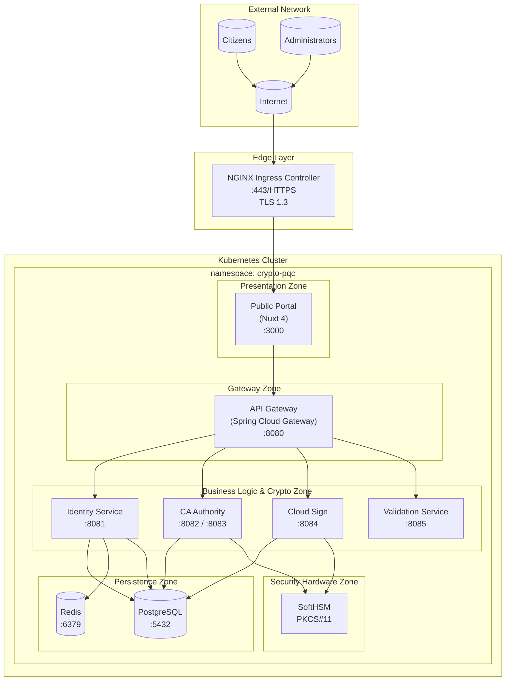
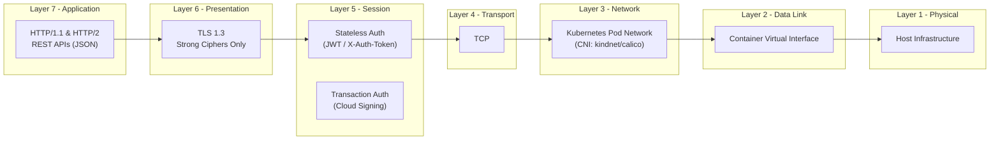
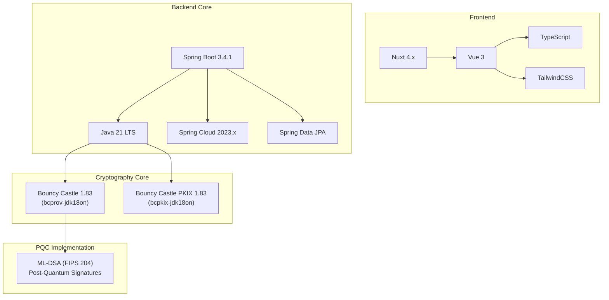
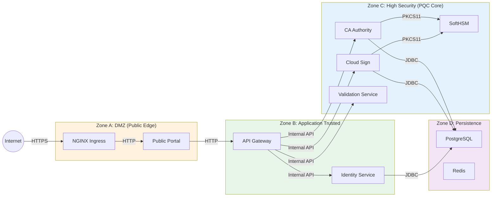
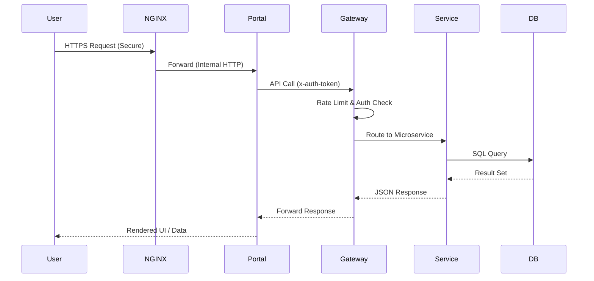

# Infrastructure & Network Design

Post-Quantum Cryptography Digital Signature System for Public Administration.

## 1. Network Architecture

### 1.1 Network Topology

The system is designed for deployment in a Kubernetes environment (Kind for development, Standard K8s for Production) with a strict separation of concerns using Namespaces and Network Policies.



### 1.2 DNS Configuration

| Domain | Target | Purpose |
|--------|--------|---------|
| `portal.gov-id.lvh.id.vn` | Ingress → Public Portal | Citizen & Admin UI |
| `api.gov-id.lvh.id.vn` | Ingress → API Gateway | Unified REST API Endpoint |

### 1.3 Service Port Mapping

| Service | Container Port | Service Port (ClusterIP) | Protocol | Notes |
|---------|----------------|--------------------------|----------|-------|
| NGINX Ingress | 443 | 443 | HTTPS | TLS 1.3 Termination |
| Public Portal | 3000 | 80 | HTTP | Internal traffic only |
| API Gateway | 8080 | 8080 | HTTP | Central entry point |
| Identity Service | 8081 | 8081 | HTTP | Auth, KYC, User Mgmt |
| CA Authority | 8082 | 8082 | HTTP | PKI Core Operations |
| CA Authority (RA) | 8083 | 8083 | HTTP | Registration Authority Ops |
| Cloud Sign | 8084 | 8084 | HTTP | CSC Signing Operations |
| Validation SVC | 8080 | 8085 | HTTP | Signature Verification |
| PostgreSQL | 5432 | 5432 | TCP | Primary Data Store |

---

## 2. Network Layers (OSI Model)

### 2.1 Layer Stack



---

## 3. Operating System & Container Design

### 3.1 Container Base Images

We prioritize minimal, secure base images to reduce attack surface.

| Component Type | Base Image | Size (Approx) | Rationale |
|----------------|------------|---------------|-----------|
| **Java Microservices** | `eclipse-temurin:21-jre` | ~250MB | Official Java 21 JRE for Spring Boot 3 & Bouncy Castle 1.83 compatibility |
| **Frontend/Node** | `node:20-slim` | ~180MB | Minimal Node.js 20 environment for Nuxt 4 SSR |
| **Ingress** | `nginx:alpine` | ~25MB | Alpine-based high-performance proxy |
| **Database** | `postgres:15-alpine` | ~80MB | Stable, lightweight Persistence |

### 3.2 Resource Allocation Strategy

Resource limits are tuned for **ML-DSA (Dilithium)** operations, which are computationally intensive and memory-heavy compared to traditional ECDSA/RSA.

| Service | CPU Request | CPU Limit | Memory Request | Memory Limit | Critical Reason |
|---------|-------------|-----------|----------------|--------------|-----------------|
| **CA Authority** | 100m | 1000m | 512Mi | **2Gi** | ML-DSA Key Generation requires significant heap space |
| **Cloud Sign** | 100m | 1000m | 512Mi | **2Gi** | Concurrent ML-DSA Signing operations |
| **Validation SVC** | 50m | 500m | 512Mi | 1Gi | Signature verification is moderately intensive |
| **API Gateway** | 100m | 1000m | 512Mi | 768Mi | Routing & Rate Limiting throughput |
| **Identity SVC** | 100m | 500m | 256Mi | 512Mi | Standard CRUD operations |

### 3.3 Security Hardening

All Pods are configured with strict security contexts to adhere to non-root policies:

```yaml
securityContext:
  runAsNonRoot: true
  runAsUser: 1000      # Application user
  fsGroup: 1000        # Filesystem group access
  readOnlyRootFilesystem: true  # Prevents runtime malware persistence
  allowPrivilegeEscalation: false
  capabilities:
    drop: ["ALL"]      # Drop NET_ADMIN, SYS_ADMIN, etc.
```

---

## 4. Application Architecture

### 4.1 Technology Stack & Dependencies



### 4.2 Application Integration Layers

1.  **Transport Layer**:
    *   **External**: HTTPS (TLS 1.3) via NGINX Ingress.
    *   **Internal**: HTTP via Kubernetes Service Mesh (ClusterIP).

2.  **API Gateway Layer (Spring Cloud Gateway)**:
    *   Centralized authentication check (Session Token validation).
    *   Route dispatching:
        *   `/api/v1/auth/**` -> Identity Service
        *   `/api/v1/certificates/**` -> CA Authority
        *   `/csc/v1/**` -> Cloud Sign (Cloud Signing Consortium API)
        *   `/validation/**` -> Validation Service

3.  **Cryptographic Layer (Common Library)**:
    *   Centralized `common-crypto` library used by CA, Cloud Sign, and Validation services.
    *   Wraps Bouncy Castle 1.83 APIs for **ML-DSA-44/65/87** keypair generation, signing, and verification.
    *   Abstracts `KeyStore` interactions (PKCS#11 for HSM, PKCS#12 for local dev).

4.  **Hardware Abstraction Layer**:
    *   Services communicate with **SoftHSMv2** via the PKCS#11 interface.
    *   Ensures private keys never leave the secure boundary (software simulation of FIPS 140-2 Level 3 HSM).

### 4.3 Service Dependencies

| Service | Upstream Dependencies | Downstream Dependencies |
|---------|-----------------------|-------------------------|
| **Public Portal** | Browser/User | API Gateway |
| **API Gateway** | Public Portal | Identity, CA, Cloud Sign, Validation |
| **Identity SVC** | API Gateway | PostgreSQL, Redis |
| **CA Authority** | API Gateway, Cloud Sign | PostgreSQL, HSM |
| **Cloud Sign** | API Gateway | PostgreSQL, HSM, CA Authority (for cert validation) |
| **Validation SVC** | API Gateway | CA Authority (for chain validation via CRL/OCSP) |

---

## 5. Security Architecture

### 5.1 Network Security Zones

We define strict zones to control traffic flow and data access.



### 5.2 Access Control Rules

1.  **Public Access**: Only port 443 (HTTPS) is exposed to the internet via NGINX.
2.  **Database Access**: Restricted to specific microservices (Identity, CA, Cloud Sign). **No direct external access**.
3.  **HSM Access**: Restricted strictly to `ca-authority` and `cloud-sign` pods.
4.  **Inter-Service Communication**:
    *   Frontend **MUST** go through API Gateway.
    *   No direct calls from Frontend to backend microservices.

### 5.3 Authentication & Authorization

*   **User Auth**: Session-based authentication using Redis (for stateful sessions) and opaque tokens passed via `X-Auth-Token`.
*   **Signing Auth**:
    *   **Level 1**: Session authentication.
    *   **Level 2 (Step-up)**: **TOTP** (Time-based One-Time Password) required for every signing operation via Cloud Sign, adhering to **Use Sole Control** principles.

---

## 6. Data Flows

### 6.1 Request Lifecycle



