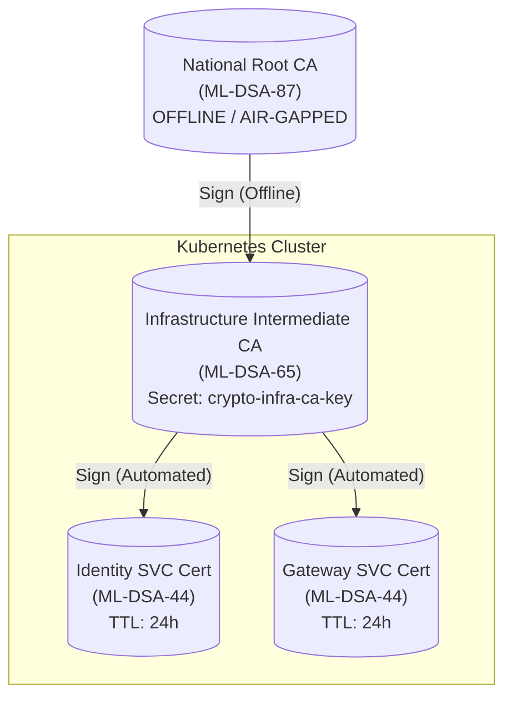
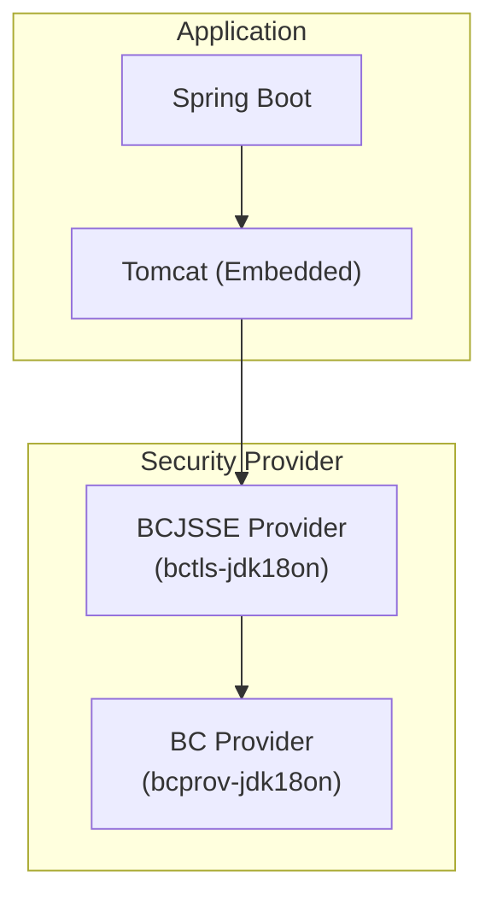

# Internal mTLS Design & Migration Plan (PQC Enhanced)

## 1. Analysis of Current State

### Infrastructure
- **Orchestration**: Kubernetes
- **Gateway**: Spring Cloud Gateway (currently routing `http://`)
- **Services**: Spring Boot 3.4
- **Crypto Stack**: Java 21 + Bouncy Castle 1.83 (PQC-enabled)

### The Goal: Unified Quantum-Safe Zero Trust
- **Unified Trust Anchor**: Use the **Offline National Root CA** (ML-DSA-87) as the ultimate trust anchor for both Citizen Identity and Infrastructure Security.
- **Risk Mitigation**: Use a dedicated **Infrastructure Intermediate CA** for mTLS to prevent "Hot Wallet" risks (Root Key exposure).

---

## 2. Architecture Design

### 2.1 Post-Quantum PKI Hierarchy (2-Tier)
Instead of a separate mTLS PKI, we delegate trust from the National Root:



1.  **Tier 1: Offline Root CA (ML-DSA-87)**
    *   Exists only on air-gapped machine.
    *   Signs the Infrastructure Intermediate CA's request (CSR).
2.  **Tier 2: Infrastructure CA (ML-DSA-65)**
    *   Private key stored in K8s Secret `crypto-infra-ca-key`.
    *   Used by the init containers to sign short-lived mTLS certs.
    *   **Revocation**: If cluster is compromised, Root CA revokes ONLY this Intermediate CA.

### 2.2 Application Stack Requirements
Services require **Bouncy Castle JSSE (`bctls`)** to handle ML-DSA TLS handshakes.



### 2.3 Certificate Distribution (Init Pattern)

1.  **Init Container (`pqc-bootstrap`)**:
    *   Mounts `crypto-infra-ca-key`.
    *   Generates ephemeral ML-DSA-44 keypair.
    *   Signs ephemeral cert with Infra CA key.
    *   Writes `service.pem`, `service-key.pem` to shared volume.
2.  **Spring Boot**:
    *   Starts with SSL Bundle pointing to shared volume.
    *   Trusts `root-ca.crt` (mounted via ConfigMap).

---

## 3. Implementation Plan

### Phase 1: offline-ca Operations
1.  **Generate Infra CA Key/CSR**:
    *   Use `pqc-tool` to generate ML-DSA-65 keypair for "Infrastructure CA".
    *   Generate CSR: `CN=Gov Internal Infra CA, O=Government`.
2.  **Sign with Offline Root**:
    *   Use `offline-ca sign-csr` to issue the Intermediate Cert.
3.  **Import to K8s**:
    *   `kubectl create secret generic crypto-infra-ca-key --from-file=key.pem --from-file=cert.pem`

### Phase 2: Dependency Upgrade
1.  **Add `bctls` Dependency**:
    In `libs/common-crypto/build.gradle.kts`:
    ```kotlin
    implementation("org.bouncycastle:bctls-jdk18on:1.83")
    ```
2.  **Register Provider**:
    Update `PqcCryptoService` or `CryptoConfig` to register `BouncyCastleJsseProvider`.

### Phase 3: Service Configuration
1.  **Configure Spring Boot**:
    ```yaml
    server:
      ssl:
        protocol: TLSv1.3
        key-store-type: PKCS12
        enabled-protocols: TLSv1.3
        client-auth: need
    ```
2.  **Init Container**:
    Create `pqc-init` Docker image containing `common-crypto` jar to perform the automated signing on pod startup.

### Phase 4: Migration
1.  **Deploy**: Rollout Identity Service with mTLS.
2.  **Gateway**: Configure Gateway with its own client certificate (signed by Infra CA).

---

## 4. Feasibility & Security
*   **Security**: **Excellent**. Compromise of the K8s cluster does not compromise the National Root (Citizen IDs are safe).
*   **Compliance**: Consistent with standard PKI hierarchy practices (Root -> Intermediate -> Leaf).
*   **Performance**: ML-DSA-44 for mTLS is performant enough for internal traffic.
