# PQC Digital Signature System - Flow Diagrams

## System Architecture Overview

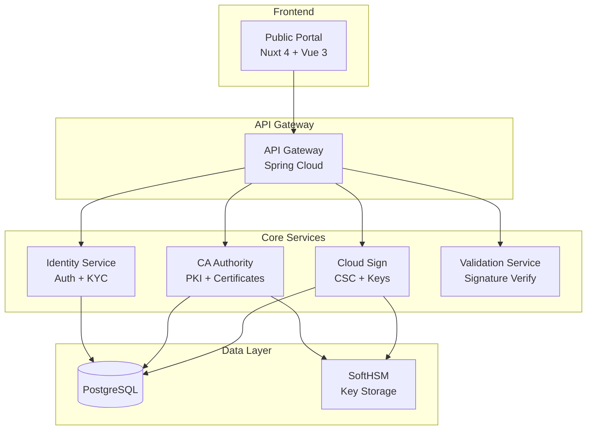
```mermaid
graph TB
    subgraph "Frontend"
        PP[Public Portal<br/>Nuxt 4 + Vue 3]
    end
    
    subgraph "API Gateway"
        GW[API Gateway<br/>Spring Cloud]
    end
    
    subgraph "Core Services"
        IS[Identity Service<br/>Auth + KYC]
        CA[CA Authority<br/>PKI + Certificates]
        CS[Cloud Sign<br/>CSC + Keys]
        VS[Validation Service<br/>Signature Verify]
    end
    
    subgraph "Data Layer"
        PG[(PostgreSQL)]
        HSM[SoftHSM<br/>Key Storage]
    end
    
    PP --> GW
    GW --> IS
    GW --> CA
    GW --> CS
    GW --> VS
    
    IS --> PG
    CA --> PG
    CA --> HSM
    CS --> PG
    CS --> HSM
```

---

## Flow 1a: User Registration

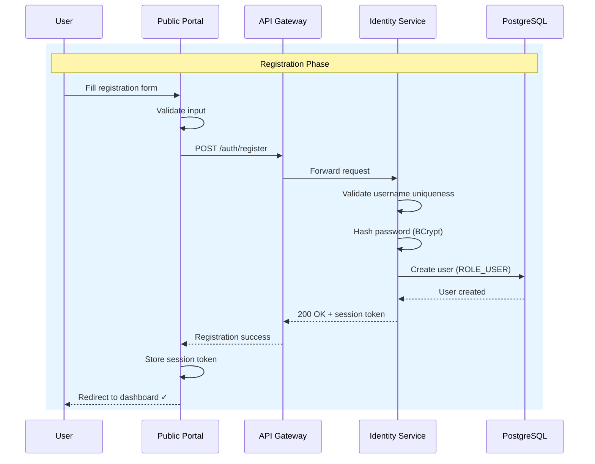
```mermaid
sequenceDiagram
    participant U as User
    participant PP as Public Portal
    participant GW as API Gateway
    participant IS as Identity Service
    participant DB as PostgreSQL

    rect rgb(230, 245, 255)
        Note over U,DB: Registration Phase
        U->>PP: Fill registration form
        PP->>PP: Validate input
        PP->>GW: POST /auth/register
        GW->>IS: Forward request
        IS->>IS: Validate username uniqueness
        IS->>IS: Hash password (BCrypt)
        IS->>DB: Create user (ROLE_USER)
        DB-->>IS: User created
        IS-->>GW: 200 OK + session token
        GW-->>PP: Registration success
        PP->>PP: Store session token
        PP-->>U: Redirect to dashboard ✓
    end
```

---

## Flow 1b: KYC Document Submission

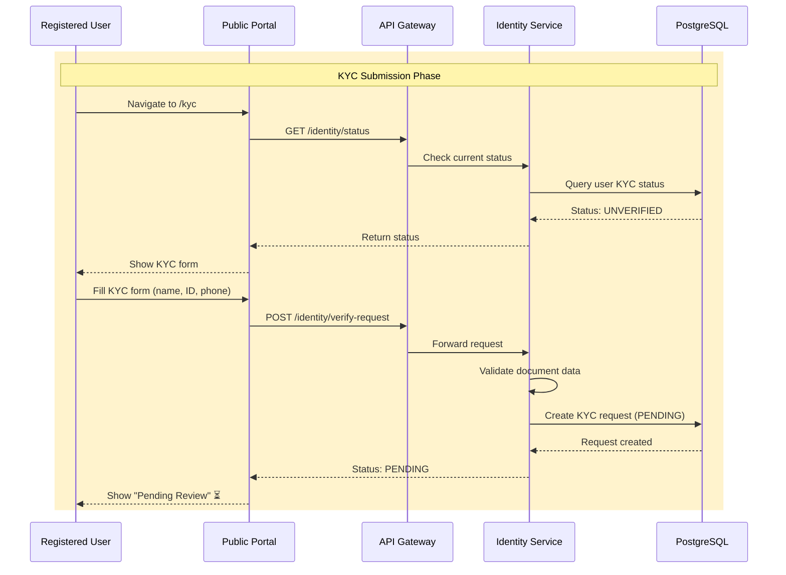
```mermaid
sequenceDiagram
    participant U as Registered User
    participant PP as Public Portal
    participant GW as API Gateway
    participant IS as Identity Service
    participant DB as PostgreSQL

    rect rgb(255, 243, 205)
        Note over U,DB: KYC Submission Phase
        U->>PP: Navigate to /kyc
        PP->>GW: GET /identity/status
        GW->>IS: Check current status
        IS->>DB: Query user KYC status
        DB-->>IS: Status: UNVERIFIED
        IS-->>PP: Return status
        PP-->>U: Show KYC form
        U->>PP: Fill KYC form (name, ID, phone)
        PP->>GW: POST /identity/verify-request
        GW->>IS: Forward request
        IS->>IS: Validate document data
        IS->>DB: Create KYC request (PENDING)
        DB-->>IS: Request created
        IS-->>PP: Status: PENDING
        PP-->>U: Show "Pending Review" ⏳
    end
```

---

## Flow 1c: Admin KYC Approval

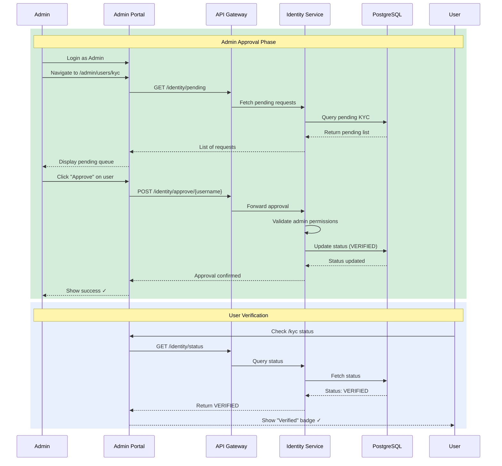
```mermaid
sequenceDiagram
    participant A as Admin
    participant PP as Admin Portal
    participant GW as API Gateway
    participant IS as Identity Service
    participant DB as PostgreSQL
    participant U as User

    rect rgb(212, 237, 218)
        Note over A,U: Admin Approval Phase
        A->>PP: Login as Admin
        A->>PP: Navigate to /admin/users/kyc
        PP->>GW: GET /identity/pending
        GW->>IS: Fetch pending requests
        IS->>DB: Query pending KYC
        DB-->>IS: Return pending list
        IS-->>PP: List of requests
        PP-->>A: Display pending queue
        A->>PP: Click "Approve" on user
        PP->>GW: POST /identity/approve/{username}
        GW->>IS: Forward approval
        IS->>IS: Validate admin permissions
        IS->>DB: Update status (VERIFIED)
        DB-->>IS: Status updated
        IS-->>PP: Approval confirmed
        PP-->>A: Show success ✓
    end

    rect rgb(232, 240, 254)
        Note over A,U: User Verification
        U->>PP: Check /kyc status
        PP->>GW: GET /identity/status
        GW->>IS: Query status
        IS->>DB: Fetch status
        DB-->>IS: Status: VERIFIED
        IS-->>PP: Return VERIFIED
        PP-->>U: Show "Verified" badge ✓
    end
```

---

## Flow 2: Certificate Enrollment

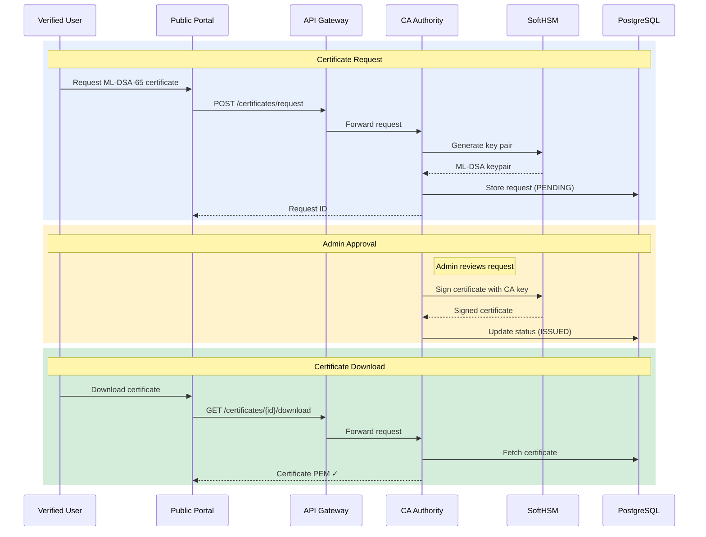
```mermaid
sequenceDiagram
    participant U as Verified User
    participant PP as Public Portal
    participant GW as API Gateway
    participant CA as CA Authority
    participant HSM as SoftHSM
    participant DB as PostgreSQL

    rect rgb(232, 240, 254)
        Note over U,DB: Certificate Request
        U->>PP: Request ML-DSA-65 certificate
        PP->>GW: POST /certificates/request
        GW->>CA: Forward request
        CA->>HSM: Generate key pair
        HSM-->>CA: ML-DSA keypair
        CA->>DB: Store request (PENDING)
        CA-->>PP: Request ID
    end

    rect rgb(255, 243, 205)
        Note over U,DB: Admin Approval
        Note right of CA: Admin reviews request
        CA->>HSM: Sign certificate with CA key
        HSM-->>CA: Signed certificate
        CA->>DB: Update status (ISSUED)
    end

    rect rgb(212, 237, 218)
        Note over U,DB: Certificate Download
        U->>PP: Download certificate
        PP->>GW: GET /certificates/{id}/download
        GW->>CA: Forward request
        CA->>DB: Fetch certificate
        CA-->>PP: Certificate PEM ✓
    end
```

---

## Flow 3: Document Signing (Cloud-Sign with TOTP)

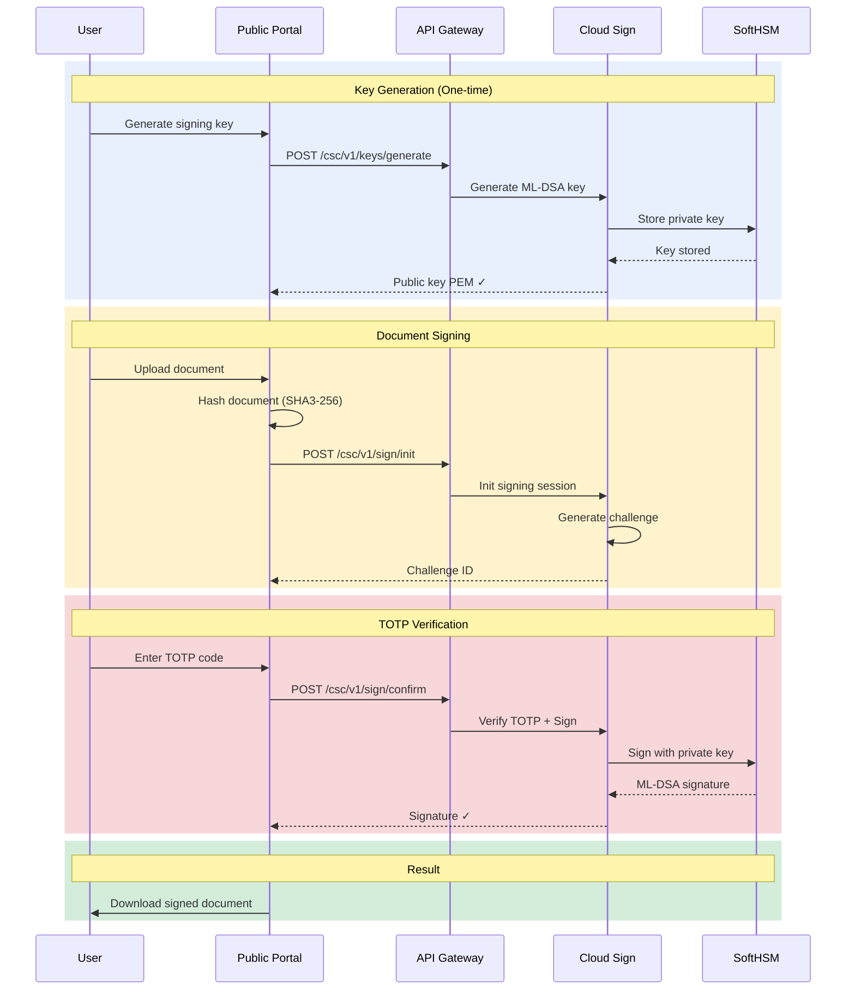
```mermaid
sequenceDiagram
    participant U as User
    participant PP as Public Portal
    participant GW as API Gateway
    participant CS as Cloud Sign
    participant HSM as SoftHSM

    rect rgb(232, 240, 254)
        Note over U,HSM: Key Generation (One-time)
        U->>PP: Generate signing key
        PP->>GW: POST /csc/v1/keys/generate
        GW->>CS: Generate ML-DSA key
        CS->>HSM: Store private key
        HSM-->>CS: Key stored
        CS-->>PP: Public key PEM ✓
    end

    rect rgb(255, 243, 205)
        Note over U,HSM: Document Signing
        U->>PP: Upload document
        PP->>PP: Hash document (SHA3-256)
        PP->>GW: POST /csc/v1/sign/init
        GW->>CS: Init signing session
        CS->>CS: Generate challenge
        CS-->>PP: Challenge ID
    end

    rect rgb(248, 215, 218)
        Note over U,HSM: TOTP Verification
        U->>PP: Enter TOTP code
        PP->>GW: POST /csc/v1/sign/confirm
        GW->>CS: Verify TOTP + Sign
        CS->>HSM: Sign with private key
        HSM-->>CS: ML-DSA signature
        CS-->>PP: Signature ✓
    end

    rect rgb(212, 237, 218)
        Note over U,HSM: Result
        PP->>U: Download signed document
    end
```

---

## Flow 4: Signature Verification

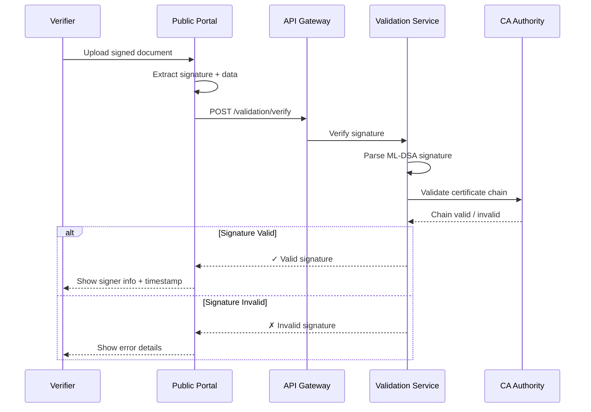
```mermaid
sequenceDiagram
    participant U as Verifier
    participant PP as Public Portal
    participant GW as API Gateway
    participant VS as Validation Service
    participant CA as CA Authority

    U->>PP: Upload signed document
    PP->>PP: Extract signature + data
    PP->>GW: POST /validation/verify
    GW->>VS: Verify signature
    
    VS->>VS: Parse ML-DSA signature
    VS->>CA: Validate certificate chain
    CA-->>VS: Chain valid / invalid
    
    alt Signature Valid
        VS-->>PP: ✓ Valid signature
        PP-->>U: Show signer info + timestamp
    else Signature Invalid
        VS-->>PP: ✗ Invalid signature
        PP-->>U: Show error details
    end
```

---

## Flow 5: CA Hierarchy Management

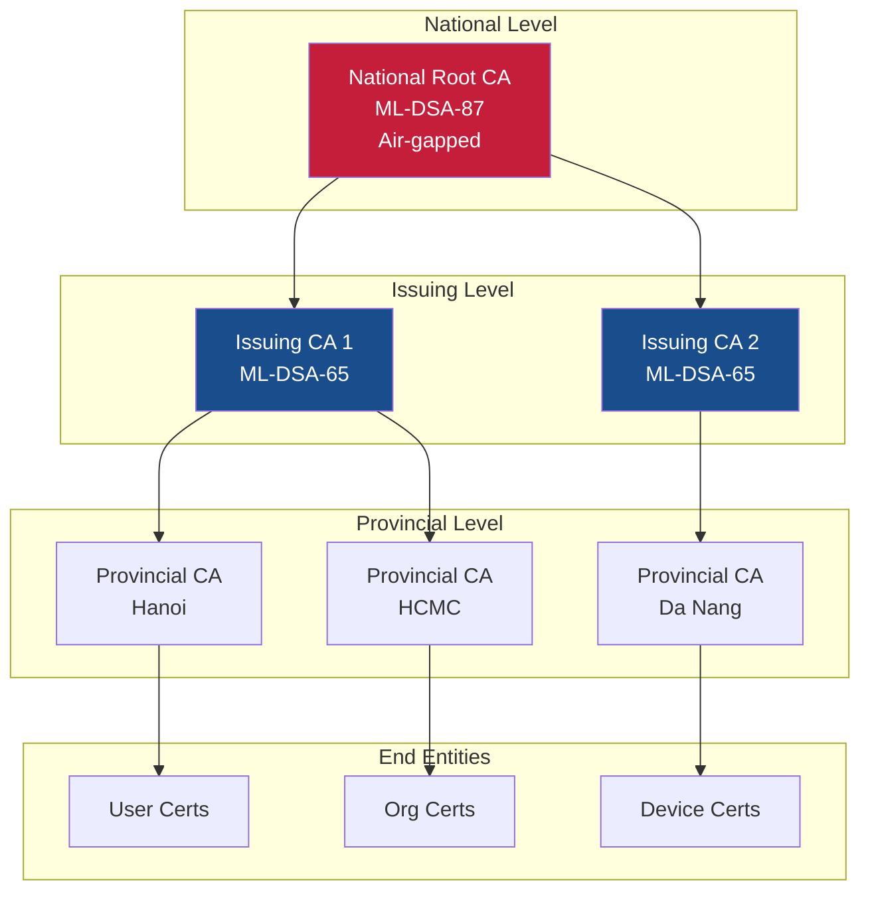
```mermaid
graph TB
    subgraph "National Level"
        ROOT[National Root CA<br/>ML-DSA-87<br/>Air-gapped]
    end
    
    subgraph "Issuing Level"
        ICA1[Issuing CA 1<br/>ML-DSA-65]
        ICA2[Issuing CA 2<br/>ML-DSA-65]
    end
    
    subgraph "Provincial Level"
        PCA1[Provincial CA<br/>Hanoi]
        PCA2[Provincial CA<br/>HCMC]
        PCA3[Provincial CA<br/>Da Nang]
    end
    
    subgraph "End Entities"
        USER1[User Certs]
        USER2[Org Certs]
        USER3[Device Certs]
    end
    
    ROOT --> ICA1
    ROOT --> ICA2
    ICA1 --> PCA1
    ICA1 --> PCA2
    ICA2 --> PCA3
    PCA1 --> USER1
    PCA2 --> USER2
    PCA3 --> USER3
    
    style ROOT fill:#c41e3a,color:#fff
    style ICA1 fill:#1a4d8c,color:#fff
    style ICA2 fill:#1a4d8c,color:#fff
```

---

## Flow 6: CA Certificate Issuance (Offline Signing)

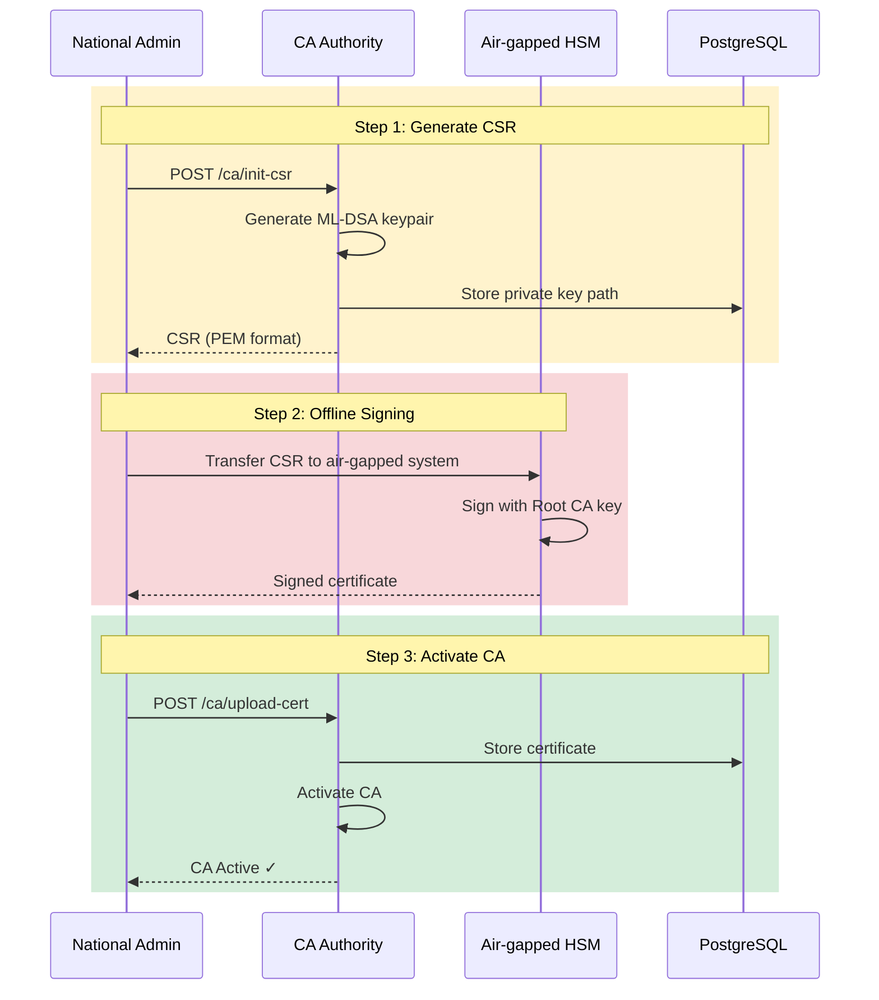
```mermaid
sequenceDiagram
    participant ADMIN as National Admin
    participant CA as CA Authority
    participant HSM as Air-gapped HSM
    participant DB as PostgreSQL

    rect rgb(255, 243, 205)
        Note over ADMIN,DB: Step 1: Generate CSR
        ADMIN->>CA: POST /ca/init-csr
        CA->>CA: Generate ML-DSA keypair
        CA->>DB: Store private key path
        CA-->>ADMIN: CSR (PEM format)
    end

    rect rgb(248, 215, 218)
        Note over ADMIN,HSM: Step 2: Offline Signing
        ADMIN->>HSM: Transfer CSR to air-gapped system
        HSM->>HSM: Sign with Root CA key
        HSM-->>ADMIN: Signed certificate
    end

    rect rgb(212, 237, 218)
        Note over ADMIN,DB: Step 3: Activate CA
        ADMIN->>CA: POST /ca/upload-cert
        CA->>DB: Store certificate
        CA->>CA: Activate CA
        CA-->>ADMIN: CA Active ✓
    end
```

---

## Complete User Journey

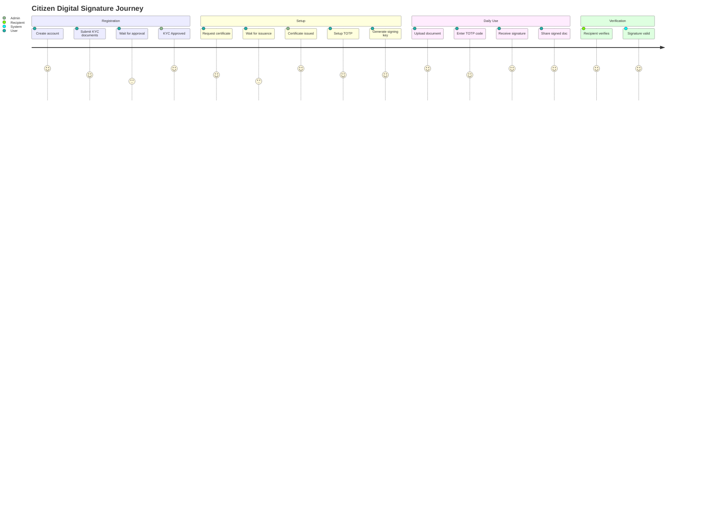
```mermaid
journey
    title Citizen Digital Signature Journey
    section Registration
      Create account: 5: User
      Submit KYC documents: 4: User
      Wait for approval: 3: User
      KYC Approved: 5: Admin
    section Setup
      Request certificate: 4: User
      Wait for issuance: 3: User
      Certificate issued: 5: Admin
      Setup TOTP: 4: User
      Generate signing key: 4: User
    section Daily Use
      Upload document: 5: User
      Enter TOTP code: 4: User
      Receive signature: 5: User
      Share signed doc: 5: User
    section Verification
      Recipient verifies: 5: Recipient
      Signature valid: 5: System
```

---

## State Diagrams

### KYC Status States

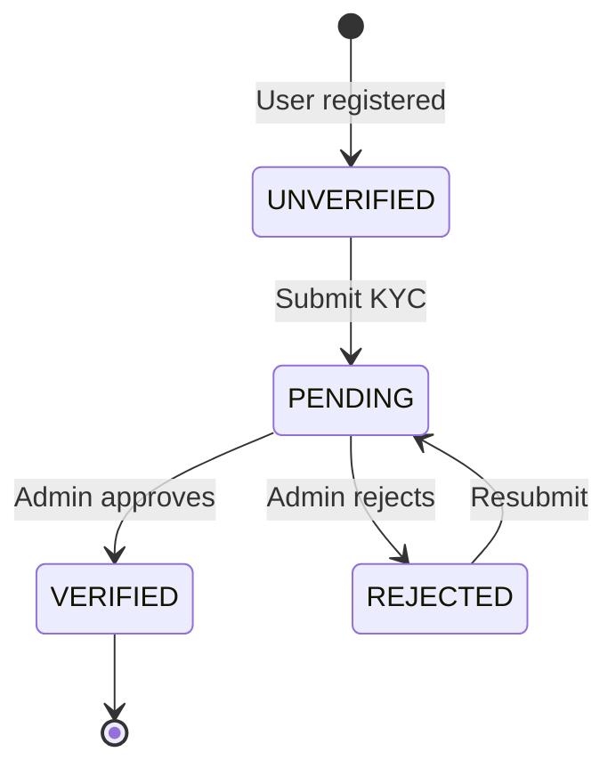
```mermaid
stateDiagram-v2
    [*] --> UNVERIFIED: User registered
    UNVERIFIED --> PENDING: Submit KYC
    PENDING --> VERIFIED: Admin approves
    PENDING --> REJECTED: Admin rejects
    REJECTED --> PENDING: Resubmit
    VERIFIED --> [*]
```

### Certificate Status States

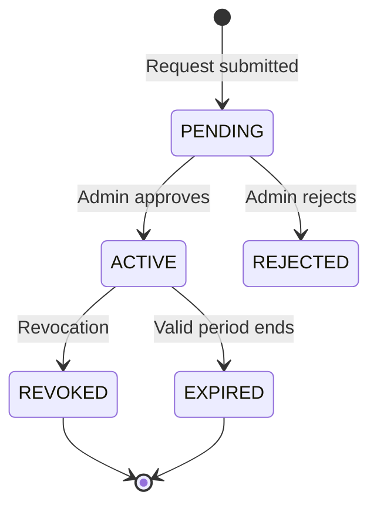
```mermaid
stateDiagram-v2
    [*] --> PENDING: Request submitted
    PENDING --> ACTIVE: Admin approves
    PENDING --> REJECTED: Admin rejects
    ACTIVE --> REVOKED: Revocation
    ACTIVE --> EXPIRED: Valid period ends
    REVOKED --> [*]
    EXPIRED --> [*]
```

---

## Flow 7: Document Storage with Encryption

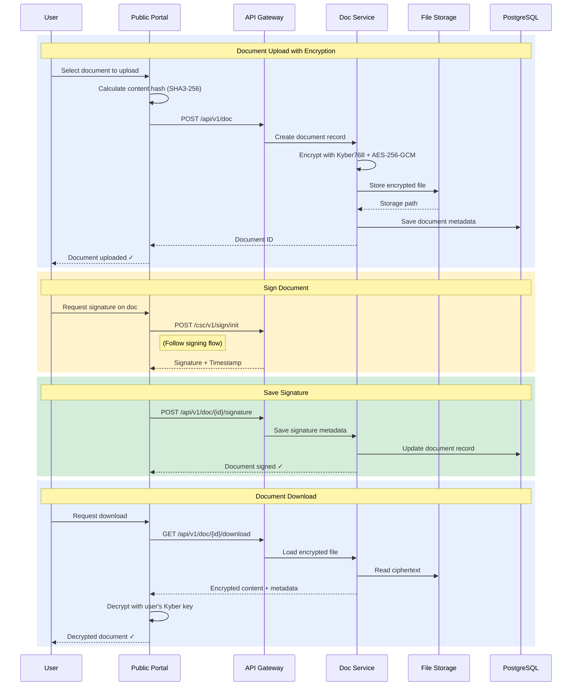
```mermaid
sequenceDiagram
    participant U as User
    participant PP as Public Portal
    participant GW as API Gateway
    participant DS as Doc Service
    participant FS as File Storage
    participant DB as PostgreSQL

    rect rgb(232, 240, 254)
        Note over U,DB: Document Upload with Encryption
        U->>PP: Select document to upload
        PP->>PP: Calculate content hash (SHA3-256)
        PP->>GW: POST /api/v1/doc
        GW->>DS: Create document record
        DS->>DS: Encrypt with Kyber768 + AES-256-GCM
        DS->>FS: Store encrypted file
        FS-->>DS: Storage path
        DS->>DB: Save document metadata
        DS-->>PP: Document ID
        PP-->>U: Document uploaded ✓
    end

    rect rgb(255, 243, 205)
        Note over U,DB: Sign Document
        U->>PP: Request signature on doc
        PP->>GW: POST /csc/v1/sign/init
        Note right of PP: (Follow signing flow)
        GW-->>PP: Signature + Timestamp
    end

    rect rgb(212, 237, 218)
        Note over U,DB: Save Signature
        PP->>GW: POST /api/v1/doc/{id}/signature
        GW->>DS: Save signature metadata
        DS->>DB: Update document record
        DS-->>PP: Document signed ✓
    end

    rect rgb(232, 240, 254)
        Note over U,DB: Document Download
        U->>PP: Request download
        PP->>GW: GET /api/v1/doc/{id}/download
        GW->>DS: Load encrypted file
        DS->>FS: Read ciphertext
        DS-->>PP: Encrypted content + metadata
        PP->>PP: Decrypt with user's Kyber key
        PP-->>U: Decrypted document ✓
    end
```

### Encryption Architecture

```
Document → AES-256-GCM(DEK) → Encrypted File
               DEK → Kyber768(User Key) → Encapsulation
```

| Algorithm | Standard | Purpose |
|-----------|----------|---------|
| Kyber768 | FIPS 203 | Key encapsulation |
| AES-256-GCM | FIPS 197 | Symmetric encryption |
| SHA3-256 | FIPS 202 | Content hashing |

---

## Document Status States

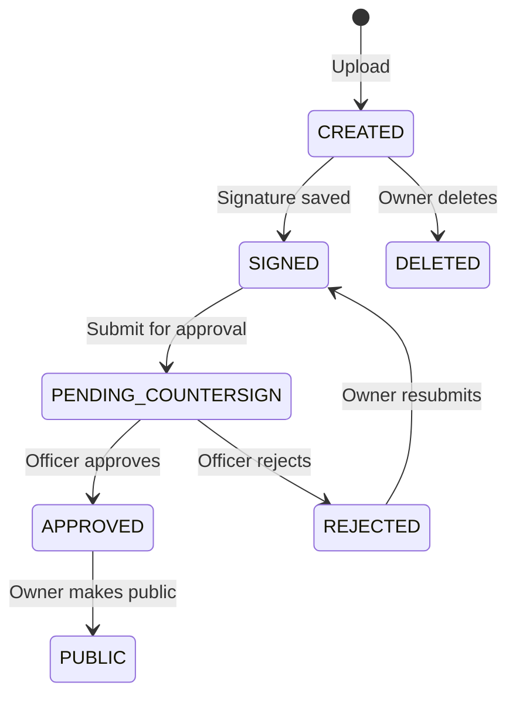
```mermaid
stateDiagram-v2
    [*] --> CREATED: Upload
    CREATED --> SIGNED: Signature saved
    SIGNED --> PENDING_COUNTERSIGN: Submit for approval
    PENDING_COUNTERSIGN --> APPROVED: Officer approves
    PENDING_COUNTERSIGN --> REJECTED: Officer rejects
    APPROVED --> PUBLIC: Owner makes public
    REJECTED --> SIGNED: Owner resubmits
    CREATED --> DELETED: Owner deletes
```

---

## Flow 8: Document Countersign Workflow

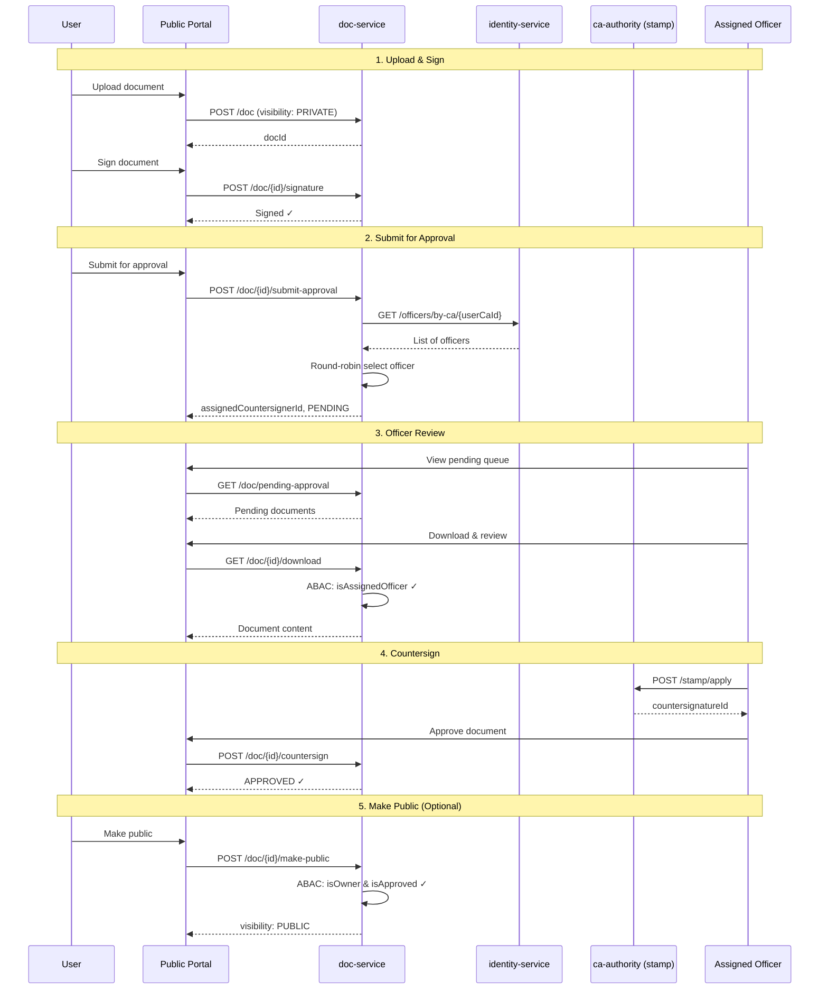
```mermaid
sequenceDiagram
    participant U as User
    participant PP as Public Portal
    participant DS as doc-service
    participant IS as identity-service
    participant CA as ca-authority (stamp)
    participant O as Assigned Officer

    Note over U,O: 1. Upload & Sign
    U->>PP: Upload document
    PP->>DS: POST /doc (visibility: PRIVATE)
    DS-->>PP: docId
    U->>PP: Sign document
    PP->>DS: POST /doc/{id}/signature
    DS-->>PP: Signed ✓

    Note over U,O: 2. Submit for Approval
    U->>PP: Submit for approval
    PP->>DS: POST /doc/{id}/submit-approval
    DS->>IS: GET /officers/by-ca/{userCaId}
    IS-->>DS: List of officers
    DS->>DS: Round-robin select officer
    DS-->>PP: assignedCountersignerId, PENDING

    Note over U,O: 3. Officer Review
    O->>PP: View pending queue
    PP->>DS: GET /doc/pending-approval
    DS-->>PP: Pending documents
    O->>PP: Download & review
    PP->>DS: GET /doc/{id}/download
    DS->>DS: ABAC: isAssignedOfficer ✓
    DS-->>PP: Document content

    Note over U,O: 4. Countersign
    O->>CA: POST /stamp/apply
    CA-->>O: countersignatureId
    O->>PP: Approve document
    PP->>DS: POST /doc/{id}/countersign
    DS-->>PP: APPROVED ✓

    Note over U,O: 5. Make Public (Optional)
    U->>PP: Make public
    PP->>DS: POST /doc/{id}/make-public
    DS->>DS: ABAC: isOwner & isApproved ✓
    DS-->>PP: visibility: PUBLIC
```

### ABAC Summary

| Action | Required | Constraint |
|--------|----------|------------|
| Download PRIVATE | Auth | `isOwner OR isAssignedOfficer` |
| Download PUBLIC | Auth | Any authenticated user |
| Submit Approval | Owner | `approvalStatus == DRAFT` |
| Countersign | Officer | `userId == assignedCountersignerId` |
| Make Public | Owner | `approvalStatus == APPROVED` |

